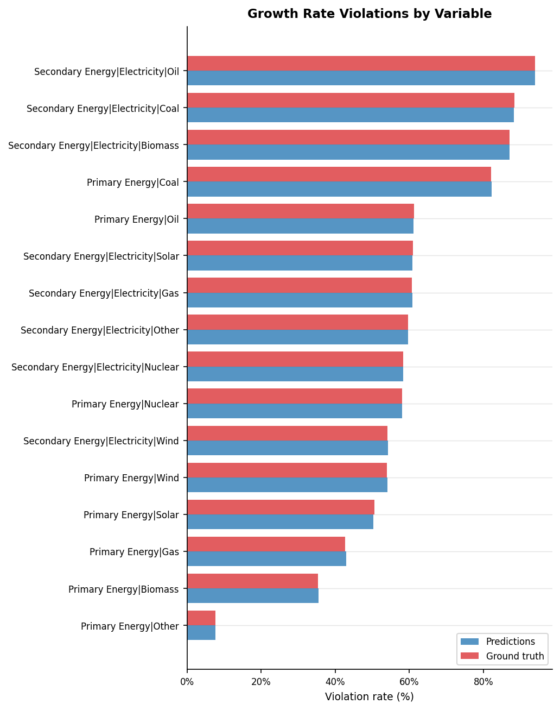
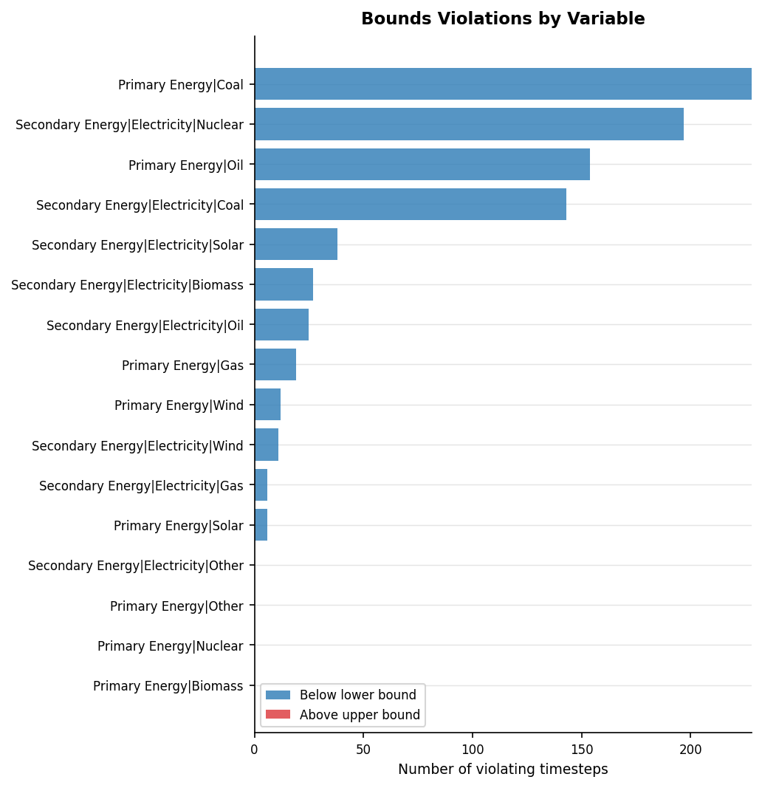
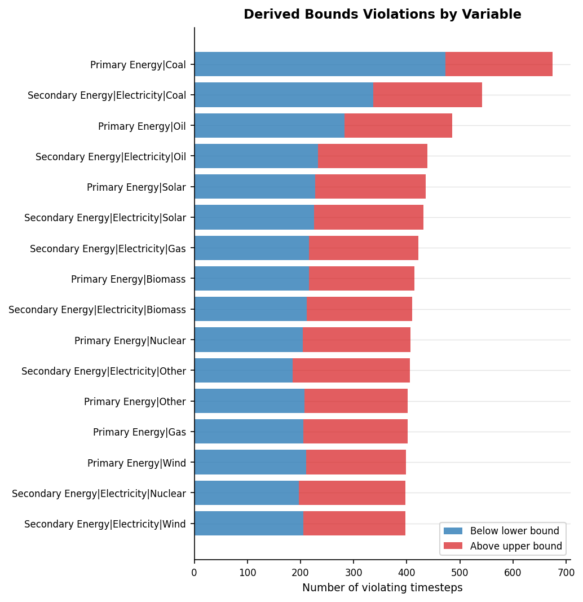
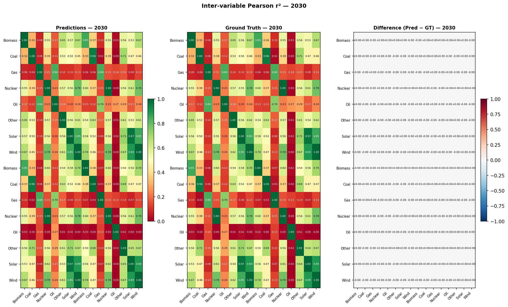
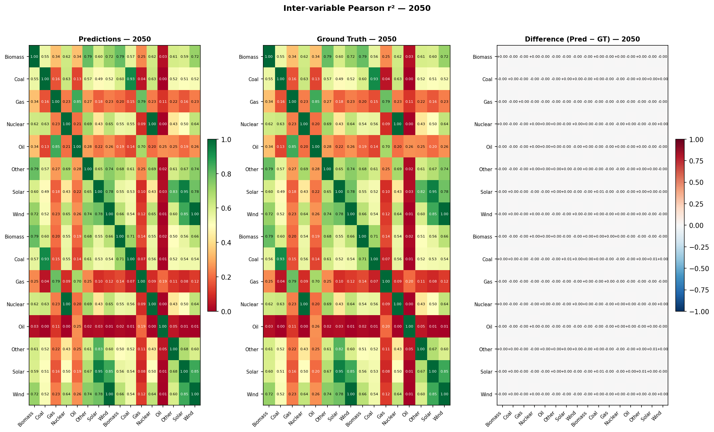
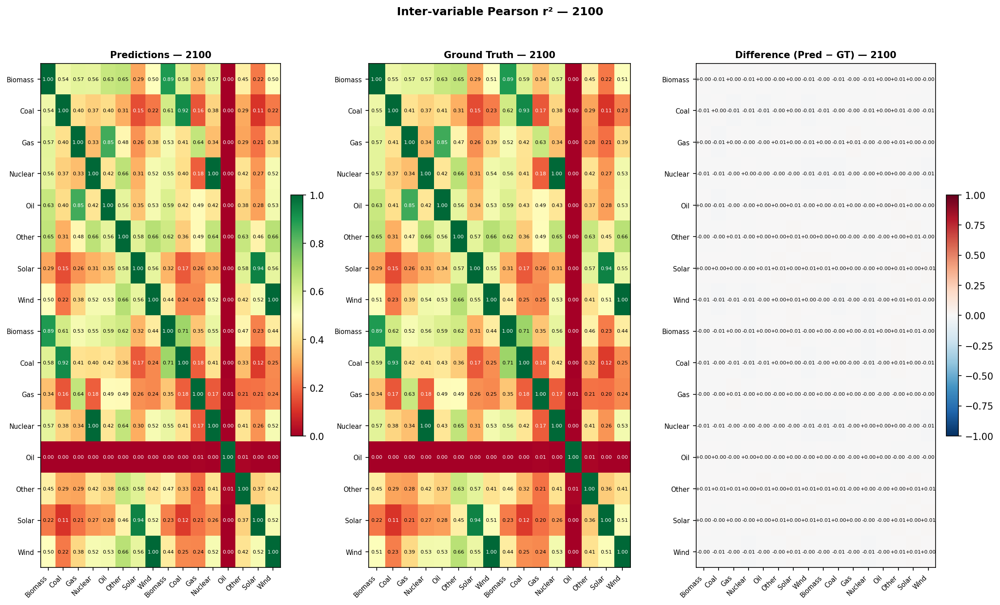
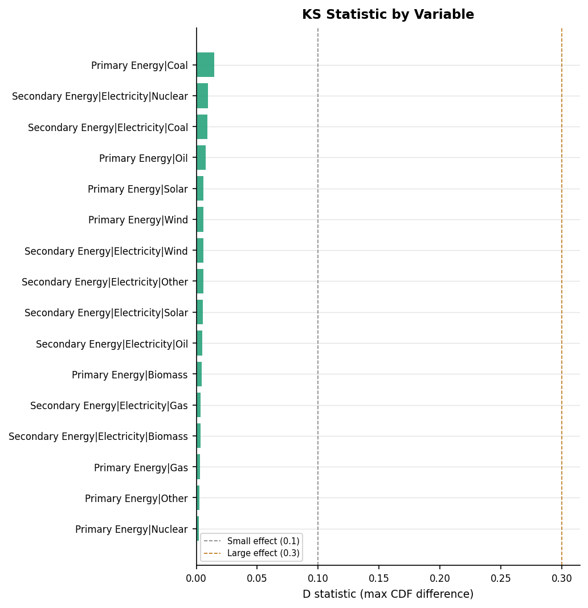
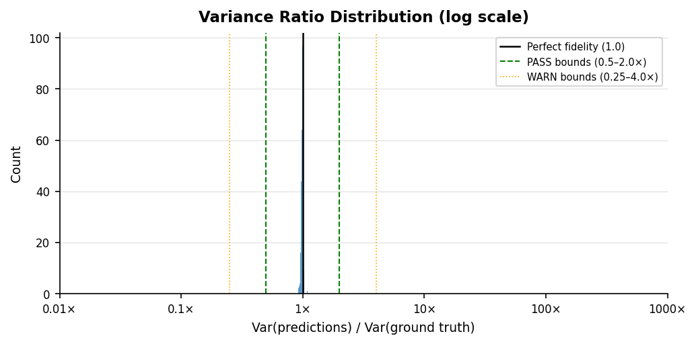
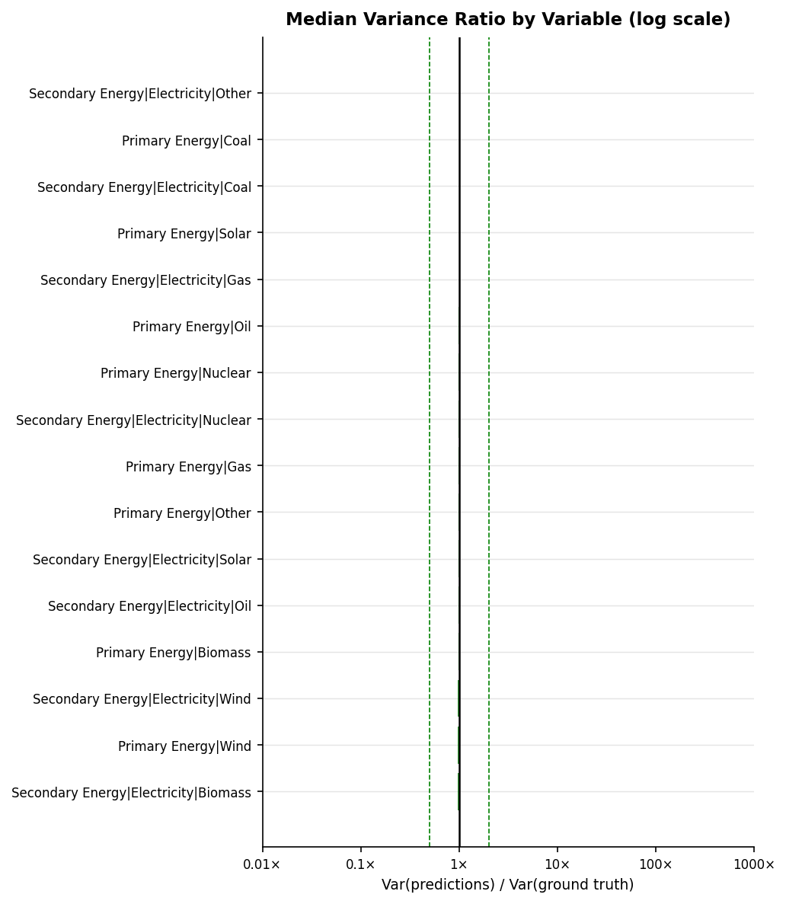

# Validation Report: gcamnet_01_iamc

**Run ID:** `gcamnet_01_iamc`
**Generated:** 2026-06-18 16:08
**Results:** `results/gcamnet_01_iamc/`

---

## Overview

**2. Growth Rate Plausibility**

| Metric | Predictions | Ground Truth |
| --- | --- | --- |
| Pass rate (timesteps) | 40.3% | 40.3% |

**3. Regional Consistency**

_No complete regional groupings in this dataset._

**4. Physical Bounds Check**

| Metric | Predictions | Ground Truth |
| --- | --- | --- |
| Pass rate (timesteps) | 99.7% | ⚠ run validate.py with --ground_truth |

**5. Hard Historical Constraints** _(PASS = within IP range, WARN = within outer tolerance)_

| Sub-check | Pass (%) | Warn (%) | Fail (%) | GT Pass (%) | GT Warn (%) | GT Fail (%) |
| --- | --- | --- | --- | --- | --- | --- |
| nuclear_energy_2020 | 0.0% | 0.1% | 99.9% | 0.0% | 0.1% | 99.9% |
| solar_wind_2020 | 1.7% | 3.8% | 94.5% | 1.7% | 3.6% | 94.7% |

**6. Soft Future Constraints**

| Sub-check | Pass (%) | Fail (%) | GT Pass (%) | GT Fail (%) |
| --- | --- | --- | --- | --- |
| nuclear_electricity_2030 | 100.0% | 0.0% | 100.0% | 0.0% |

**7. SCI Vetting Checks**

| Sub-check | Pass (%) | Warn (%) | Fail (%) | GT Pass (%) | GT Warn (%) | GT Fail (%) |
| --- | --- | --- | --- | --- | --- | --- |
| hist_primary_coal | 0.0% | 0.0% | 100.0% | 0.0% | 0.0% | 100.0% |
| hist_primary_gas | 0.0% | 0.0% | 100.0% | 0.0% | 0.0% | 100.0% |
| hist_primary_oil | 0.0% | 0.0% | 100.0% | 0.0% | 0.0% | 100.0% |

**8. Inter-variable Correlations**

| Metric | Predictions | Ground Truth |
| --- | --- | --- |
| Mean \|Δr²\| vs ground truth | 0.0021 | 0.0000 (reference) |

**9. KS Distributional Test**

| Metric | Value |
| --- | --- |
| Mean D statistic | 0.0058 |
| Variables failing (corrected) | 0 / 16 |

**10. Variance Fidelity**

| Metric | Value |
| --- | --- |
| Median variance ratio | 0.9932 |
| Pass rate (variable-regions) | 100.0% |

---

## 1. Hierarchy Sum Check

_Checks that predicted parent variables equal the sum of their direct children
at every timestep. Predictions are **expected to fail** this check — the failure
rate quantifies how much the model violates IAM accounting identities._

_Sum check results not found. Run `validate.py` first._

---

## 2. Growth Rate Plausibility

_For each predicted trajectory, checks that period-on-period growth rates
fall within empirically-derived bounds from the ground truth data._

**Total timesteps evaluated:** 307,200  
**Violations:** 183,329 (59.68%)  

**Ground truth — violation rate:** 59.65%  
_(+0.02pp difference: predictions vs ground truth)_

### Violation Rate by Variable

### Example Violation

_The most extreme growth rate violation is shown below._

#### Example violation — predictions

**Most extreme growth rate violation**

| Variable | Scenario | Region | Year (from) | Year (to) | Growth rate |
| --- | --- | --- | --- | --- | --- |
| Primary Energy\|Solar | test_12 | India | 2025 | 2030 | +1.9159 |

#### Example violation — ground truth

**Most extreme growth rate violation**

| Variable | Scenario | Region | Year (from) | Year (to) | Growth rate |
| --- | --- | --- | --- | --- | --- |
| Primary Energy\|Solar | test_12 | India | 2025 | 2030 | +1.9580 |

---

## 3. Regional Consistency

_Checks that predicted World values equal the sum of predicted subregion values
(R5 / R6 / R10 groupings). Only applicable to datasets with regional breakdowns._

_No complete regional groupings found in this dataset. The check requires all subregions in a grouping (R5/R6/R10) to have data for the same scenario-variable-year combinations. This dataset has partial regional coverage only._

---

## 4. Physical Bounds Check

_Checks predictions against hard physical lower bounds (e.g. energy variables ≥ 0).
These are structural/mathematical constraints that must hold by definition,
independent of the ground truth. Belongs to the **structural/mathematical
constraint validation** family._

**Timesteps checked:** 327,680  
**Violations:** 866 (0.264%)  
**Fully clean scenario-regions:** 20,121 / 20,480

### Violations by Variable

### Example Violation

_The most extreme bounds violation is shown below._

#### Example violation — predictions

**Most extreme bounds violation**

| Variable | Scenario | Region | Year | Value | Units | Violation type |
| --- | --- | --- | --- | --- | --- | --- |
| Primary Energy\|Gas | test_17 | Africa_Southern | 2100 | -0.4237 | EJ | Below physical lower bound (0.0) |

---

## 5. Derived Bounds Check

_Checks predictions against empirical bounds derived from the ground truth IAM
output (1st–99th percentiles per variable). The IAM's own output distribution
encodes domain knowledge about plausible values. Belongs to the **historical
and domain knowledge comparison** family._

**Timesteps checked:** 327,680  
**Violations:** 7,066 (2.156%)  
**Fully clean scenario-regions:** 18,491 / 20,480

### Violations by Variable

### Example Violation

_The most extreme derived bounds violation is shown below._

#### Example violation — predictions

**Most extreme bounds violation**

| Variable | Scenario | Region | Year | Value | Units | Violation type |
| --- | --- | --- | --- | --- | --- | --- |
| Primary Energy\|Coal | test_6 | China | 2025 | 78.618 | EJ | Above derived upper bound (30.02) |

---

## 6. Hard Historical Constraints

_Checks World-level predictions at 2020 against AR6 vetting reference values
(Nicholls et al. 2022, Table 11). PASS = within IP range, WARN = within outer
tolerance, FAIL = outside outer tolerance. Belongs to the **historical and
domain knowledge comparison** validation family._

| Sub-check | N | Pass (%) | Warn (%) | Fail (%) | GT Pass (%) | GT Fail (%) |
| --- | --- | --- | --- | --- | --- | --- |
| nuclear_energy_2020 | 1280 | 0.0000 | 0.1000 | 99.9000 | 0.0000 | 100.0000 |
| solar_wind_2020 | 1280 | 1.7000 | 3.8000 | 94.5000 | 1.8000 | 98.2000 |

_Skipped sub-checks (required variables absent): co2_eip_2020: ['Emissions|CO2'], ch4_2020: ['Emissions|CH4'], co2_change_2010_2020: ['Emissions|CO2'], ccs_2020: ['Carbon Sequestration|CCS'], primary_energy_2020: ['Primary Energy']_

⚠️ POSSIBLE UNIT MISMATCH: median 0.06108 is ~160x lower than expected 9.77 EJ. Check units for Primary Energy|Nuclear

---

## 7. Soft Future Constraints

_Checks World-level predictions at 2030–2040 against domain-knowledge
plausibility bounds from the AR6 vetting process (Table 11). Belongs to the
**historical and domain knowledge comparison** validation family._

| Sub-check | N | Pass (%) | Fail (%) | GT Pass (%) | GT Fail (%) |
| --- | --- | --- | --- | --- | --- |
| nuclear_electricity_2030 | 1280 | 100.0000 | 0.0000 | 100.0000 | 0.0000 |

_Skipped sub-checks (required variables absent): co2_not_negative_2030: ['Emissions|CO2'], ccs_2030: ['Carbon Sequestration|CCS'], ch4_2040: ['Emissions|CH4']_

---

## 8. SCI Vetting Checks

_Scenario vetting criteria from Verpoort et al. (2025), the IAMC's published
successor to the AR6 vetting criteria. Checks CO₂ EIP against CEDS-2025 data
at four anchor years (2010–2025), and CCS feasibility at 2030, 2035, and 2040.
Status: PASS = within medium-concern bounds, WARN = within strong-concern bounds,
FAIL = outside strong-concern (exclusion-level) bounds._

| Sub-check | N | Pass (%) | Fail (%) | GT Pass (%) | GT Fail (%) |
| --- | --- | --- | --- | --- | --- |
| hist_primary_coal | 5120 | 0.0000 | 100.0000 | 0.0000 | 100.0000 |
| hist_primary_gas | 5120 | 0.0000 | 100.0000 | 0.0000 | 100.0000 |
| hist_primary_oil | 5120 | 0.0000 | 100.0000 | 0.0000 | 100.0000 |

_Not run: hist_co2_eip (['Emissions|CO2']), nearterm_ccs (['Carbon Sequestration|CCS']), longterm_ccs_2035 (['Carbon Sequestration|CCS']), longterm_ccs_2040 (['Carbon Sequestration|CCS'])_

⚠️ POSSIBLE UNIT MISMATCH: median 0.1534 is ~1011x lower than expected 155 EJ. Check units for Primary Energy|Coal

⚠️ POSSIBLE UNIT MISMATCH: median 0.7803 is ~231x lower than expected 180 EJ. Check units for Primary Energy|Oil

⚠️ POSSIBLE UNIT MISMATCH: median 0.9337 is ~139x lower than expected 130 EJ. Check units for Primary Energy|Gas

---

## 9. Inter-variable Correlations

_Pearson r² between all variable pairs at years 2030, 2050, and 2100 — comparing
predictions against AR6 ground truth. A well-calibrated emulator should preserve
the correlations present in real IAM data. Methodology follows Li et al. (2025) Fig. 4._

Inter-variable Pearson r² matrices at years 2030, 2050, and 2100, comparing model predictions against AR6 ground truth. Values close to the ground truth indicate the emulator preserves real-world variable relationships. Methodology follows Li et al. (2025) Fig. 4.

### 2030

_Left: predictions. Centre: AR6 ground truth. Right: difference (blue = predictions underestimate correlation, red = overestimate)._

### 2050

_Left: predictions. Centre: AR6 ground truth. Right: difference (blue = predictions underestimate correlation, red = overestimate)._

### 2100

_Left: predictions. Centre: AR6 ground truth. Right: difference (blue = predictions underestimate correlation, red = overestimate)._

### Summary: Mean Absolute Difference in r²

_Average absolute difference between predictions and ground truth correlation matrices (off-diagonal pairs only). Lower is better._

| Year | N variables | Mean \|Δr²\| (off-diagonal) |
| --- | --- | --- |
| 2030.0 | 16.0 | 0.0012 |
| 2050.0 | 16.0 | 0.001 |
| 2100.0 | 16.0 | 0.004 |

---

## 10. KS Distributional Test

_Two-sample Kolmogorov-Smirnov test comparing the full distribution of emulator
outputs against IAM ground truth per variable. The D statistic is the maximum
absolute gap between the two empirical CDFs — it captures distributional differences
in shape, skewness, and modality that mean- or variance-level checks miss. p-values
are Bonferroni-corrected across all variables to control the familywise error rate._

**Variables tested:** 16  
**Bonferroni-corrected α:** 0.003125  
**PASS:** 16 &nbsp; **FAIL:** 0  
**Mean D statistic:** 0.0058  
_D < 0.1 = negligible, 0.1–0.3 = small, ≥ 0.3 = large effect._

### Per-variable Results

_Sorted by D statistic descending. p-values are Bonferroni-corrected._

| Variable | D statistic | p (corrected) | Effect size | Status |
| --- | --- | --- | --- | --- |
| Primary Energy\|Coal | 0.0145 | 0.4269 | negligible | PASS |
| Secondary Energy\|Electricity\|Nuclear | 0.0096 | 1.0000 | negligible | PASS |
| Secondary Energy\|Electricity\|Coal | 0.0091 | 1.0000 | negligible | PASS |
| Primary Energy\|Oil | 0.0076 | 1.0000 | negligible | PASS |
| Primary Energy\|Solar | 0.0060 | 1.0000 | negligible | PASS |
| Primary Energy\|Wind | 0.0059 | 1.0000 | negligible | PASS |
| Secondary Energy\|Electricity\|Other | 0.0058 | 1.0000 | negligible | PASS |
| Secondary Energy\|Electricity\|Wind | 0.0058 | 1.0000 | negligible | PASS |
| Secondary Energy\|Electricity\|Solar | 0.0053 | 1.0000 | negligible | PASS |
| Secondary Energy\|Electricity\|Oil | 0.0049 | 1.0000 | negligible | PASS |
| Primary Energy\|Biomass | 0.0046 | 1.0000 | negligible | PASS |
| Secondary Energy\|Electricity\|Gas | 0.0035 | 1.0000 | negligible | PASS |
| Secondary Energy\|Electricity\|Biomass | 0.0034 | 1.0000 | negligible | PASS |
| Primary Energy\|Gas | 0.0029 | 1.0000 | negligible | PASS |
| Primary Energy\|Other | 0.0025 | 1.0000 | negligible | PASS |
| Primary Energy\|Nuclear | 0.0020 | 1.0000 | negligible | PASS |

### D Statistic by Variable

_Green = PASS, red = FAIL (Bonferroni-corrected). D measures the maximum gap between the emulator and IAM CDFs — larger values indicate greater distributional divergence._

---

## 11. Variance Fidelity

_Checks whether the emulator reproduces the marginal variance of each output
variable. Inter-variable correlation checks preserve the shape of variable
relationships but normalise out variance — this check catches whether the
emulator is systematically over- or under-dispersed. Variance ratio =
Var(predictions) / Var(ground truth); a well-calibrated emulator should be
close to 1.0. Applicable to both reconstruction and generative runs._

**Variable-region pairs evaluated:** 512  
**Skipped** (near-constant GT): 0  
**PASS:** 512 &nbsp; **WARN:** 0 &nbsp; **FAIL:** 0  
_PASS = variance ratio within 0.5–2.0×; WARN = 0.25–0.5× or 2.0–4.0×; FAIL = outside 4×._

### Per-variable Summary

_Median variance ratio and CV ratio across regions. Values below 1.0 indicate the emulator is under-dispersed; above 1.0 it is over-dispersed._

| Variable | Var Ratio | CV Ratio | Pass Rate | Warn Rate | Fail Rate |
| --- | --- | --- | --- | --- | --- |
| Secondary Energy\|Electricity\|Biomass | 0.9724 | 0.9943 | 1.0000 | 0.0000 | 0.0000 |
| Primary Energy\|Wind | 0.9733 | 0.9970 | 1.0000 | 0.0000 | 0.0000 |
| Secondary Energy\|Electricity\|Wind | 0.9733 | 0.9969 | 1.0000 | 0.0000 | 0.0000 |
| Primary Energy\|Biomass | 0.9801 | 1.0005 | 1.0000 | 0.0000 | 0.0000 |
| Secondary Energy\|Electricity\|Oil | 0.9850 | 0.9944 | 1.0000 | 0.0000 | 0.0000 |
| Secondary Energy\|Electricity\|Solar | 0.9909 | 0.9926 | 1.0000 | 0.0000 | 0.0000 |
| Primary Energy\|Other | 0.9918 | 0.9981 | 1.0000 | 0.0000 | 0.0000 |
| Primary Energy\|Gas | 0.9920 | 1.0011 | 1.0000 | 0.0000 | 0.0000 |
| Secondary Energy\|Electricity\|Nuclear | 0.9945 | 0.9985 | 1.0000 | 0.0000 | 0.0000 |
| Primary Energy\|Nuclear | 0.9948 | 0.9988 | 1.0000 | 0.0000 | 0.0000 |
| Primary Energy\|Oil | 0.9953 | 0.9998 | 1.0000 | 0.0000 | 0.0000 |
| Secondary Energy\|Electricity\|Gas | 0.9964 | 1.0033 | 1.0000 | 0.0000 | 0.0000 |
| Primary Energy\|Solar | 0.9969 | 0.9940 | 1.0000 | 0.0000 | 0.0000 |
| Secondary Energy\|Electricity\|Coal | 0.9971 | 1.0024 | 1.0000 | 0.0000 | 0.0000 |
| Primary Energy\|Coal | 0.9981 | 1.0044 | 1.0000 | 0.0000 | 0.0000 |
| Secondary Energy\|Electricity\|Other | 1.0032 | 0.9987 | 1.0000 | 0.0000 | 0.0000 |

### Variance Ratio Distribution

### Median Variance Ratio by Variable

_Log scale — green = PASS, orange = WARN, red = FAIL. Bars left of centre = under-dispersed; right = over-dispersed._

---

## 11. Reconstruction Error Metrics

_Applies to reconstruction emulators only (1:1 correspondence between predicted
and ground truth scenarios). Normalised RMSE (nRMSE = RMSE / mean|ground truth|)
is dimensionless and comparable across variables. The portrait plot shows performance
across all variable-region pairs simultaneously. The temporal drift chart diagnoses
autoregressive error accumulation over the projection horizon._

_Error metrics results not found. Run `validate.py` with `--method_type reconstruction` to generate them._

