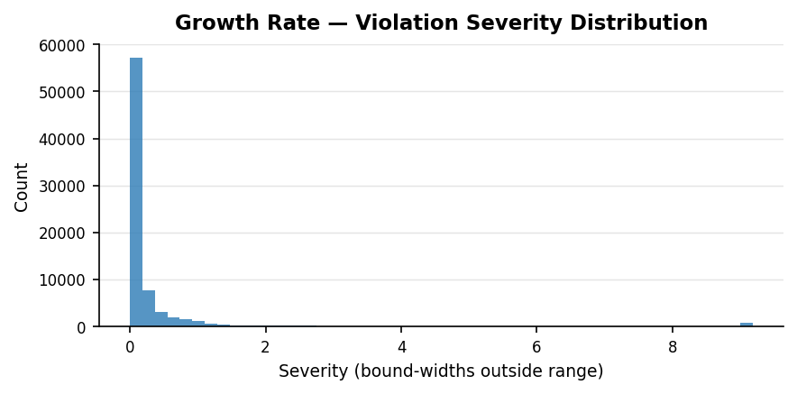

# Validation Report: li_vae_01

**Run ID:** `li_vae_01`
**Generated:** 2026-05-05 11:54
**Results path:** `results/xgb/li_vae_01/`

---

## Overview

| Check | Metric | Predictions | Ground Truth |
| --- | --- | --- | --- |
| Hierarchy Sum Check | Scenario-region pass rate | 14.1% | 29.5% |
|  | Mean relative error | 2.698% | 26.303% |
| Growth Rate Plausibility | Timestep violation rate | 2.0% | 1.9% |
| Physical Bounds Check | Timestep violation rate | 1.94% | 1.72% |
| Inter-variable Correlations | Mean \|Δr²\| vs ground truth | 0.0415 | 0.0000 (reference) |

---

## 1. Hierarchy Sum Check

_Checks that predicted parent variables equal the sum of their direct children
at every timestep. Predictions are **expected to fail** this check — the failure
rate quantifies how much the model violates the sum constraint. Compare to the
ground truth pass rate to understand baseline data consistency._

### Pass Rates by Parent Variable

| Parent Variable | Scenario-regions | Pass rate (%) | Mean error (%) | Max error (%) |
| --- | --- | --- | --- | --- |
| Secondary Energy\|Electricity | 30000 | 14.0633 | 2.6981 | 33.3326 |

### Error Distribution

### Mean Error by Year

### Error Percentile Comparison — Predictions vs Ground Truth

| Percentile | Predictions (%) | Ground truth (%) |
| --- | --- | --- |
| p50 | 2.3036 | 15.9965 |
| p75 | 3.3797 | 43.3961 |
| p90 | 4.7061 | 54.7023 |
| p95 | 5.8137 | 60.3917 |
| p99 | 9.7373 | 65.0777 |

### Example Failure

_The median failing scenario (by mean error) is shown below to illustrate a typical hierarchy violation._

#### Example failure — predictions

**Scenario:** VAE | gen_09944 | World | C1234  
**Parent variable:** Secondary Energy|Electricity  
**Mean error:** 2.55%  (median failing scenario)

| Year | Nuclear | Oil | Solar | Wind | Hydro | Geothermal | Gas | Coal | Biomass | Sum of children (EJ/yr) | Parent value (EJ/yr) | Difference | Error (%) |
| --- | --- | --- | --- | --- | --- | --- | --- | --- | --- | --- | --- | --- | --- |
| 2020.0 | 7.679 | 2.002 | 4.165 | 6.357 | 17.998 | 0.914 | 26.764 | 31.251 | 1.759 | 98.889 | 100.584 | 1.695 | 1.69 |
| 2030.0 | 8.744 | 0.539 | 25.49 | 20.286 | 22.472 | 1.34 | 32.24 | 21.47 | 2.444 | 135.024 | 136.529 | 1.505 | 1.1 |
| 2040.0 | 10.921 | 0.047 | 61.686 | 48.472 | 26.671 | 1.196 | 25.785 | 3.843 | 2.067 | 180.688 | 181.749 | 1.061 | 0.58 |
| 2050.0 | 12.287 | 0.036 | 100.656 | 85.998 | 29.294 | 1.187 | 11.736 | 0.723 | 2.044 | 243.96 | 251.082 | 7.121 | 2.84 |
| 2060.0 | 12.554 | 0.012 | 152.891 | 118.152 | 30.723 | 1.196 | 7.469 | 0.342 | 1.724 | 325.063 | 330.625 | 5.563 | 1.68 |
| 2070.0 | 13.925 | 0.005 | 200.937 | 145.682 | 31.257 | 1.145 | 8.745 | 0.308 | 1.694 | 403.697 | 417.748 | 14.051 | 3.36 |
| 2080.0 | 14.022 | 0.0 | 252.267 | 156.728 | 31.789 | 1.109 | 7.922 | 0.286 | 1.104 | 465.23 | 477.292 | 12.062 | 2.53 |
| 2090.0 | 13.585 | 0.0 | 293.366 | 161.235 | 32.624 | 1.017 | 7.344 | 0.246 | 1.122 | 510.539 | 537.461 | 26.922 | 5.01 |
| 2100.0 | 14.491 | 0.0 | 337.778 | 178.996 | 31.929 | 1.117 | 7.065 | 0.248 | 1.46 | 573.084 | 598.161 | 25.077 | 4.19 |

#### Example failure — ground truth

**Scenario:** COFFEE 1.1 | EN_NPi2020_1800f | World | C5  
**Parent variable:** Primary Energy  
**Mean error:** 35.06%  (median failing scenario)

| Year | Biomass | Coal | Gas | Geothermal | Hydro | Nuclear | Oil | Solar | Wind | Sum of children | Parent value | Difference | Error (%) |
| --- | --- | --- | --- | --- | --- | --- | --- | --- | --- | --- | --- | --- | --- |
| 2010.0 | nan | 143.961 | 103.276 | nan | nan | nan | 170.056 | nan | nan | 417.293 | 489.143 | 71.85 | 14.69 |
| 2020.0 | nan | 150.698 | 131.62 | nan | nan | nan | 180.449 | nan | nan | 462.767 | 546.316 | 83.549 | 15.29 |
| 2030.0 | nan | 156.032 | 166.954 | nan | nan | nan | 184.209 | nan | nan | 507.196 | 565.654 | 58.458 | 10.33 |
| 2040.0 | nan | 131.273 | 194.944 | nan | nan | nan | 193.684 | nan | nan | 519.901 | 605.474 | 85.574 | 14.13 |
| 2050.0 | nan | 128.562 | 179.859 | nan | nan | nan | 200.806 | nan | nan | 509.227 | 641.068 | 131.841 | 20.57 |
| 2060.0 | nan | 108.762 | 173.297 | nan | nan | nan | 197.259 | nan | nan | 479.318 | 685.043 | 205.725 | 30.03 |
| 2070.0 | nan | 106.591 | 153.306 | nan | nan | nan | 195.292 | nan | nan | 455.189 | 755.438 | 300.248 | 39.74 |
| 2080.0 | nan | 91.54 | 123.865 | nan | nan | nan | 147.829 | nan | nan | 363.234 | 844.417 | 481.183 | 56.98 |
| 2090.0 | nan | 65.881 | 86.701 | nan | nan | nan | 102.422 | nan | nan | 255.004 | 921.917 | 666.913 | 72.34 |
| 2100.0 | nan | 72.052 | 76.933 | nan | nan | nan | 80.311 | nan | nan | 229.295 | 975.388 | 746.093 | 76.49 |

---

## 2. Growth Rate Plausibility

_For each predicted trajectory, checks that the 5-year period-on-period growth rate
falls within the 1st–99th percentile range observed in the AR6 test-set ground truth.
Empirical bounds are derived per variable._

**Total timesteps evaluated:** 3,840,000  
**Violations:** 76,800 (2.00%)  
**Median severity** (violations only): 0.062 bound-widths  

**Ground truth — violation rate:** 1.94%  
**Ground truth — median severity:** 0.067 bound-widths  
_(+0.06pp difference: predictions vs ground truth)_

### Violation Rate by Variable

### Empirical Bounds Used (AR6 test-set percentiles)

| Variable | Lower bound | Upper bound |
| --- | --- | --- |
| Carbon Sequestration\|CCS | -0.7966 | 41.3670 |
| Emissions\|Kyoto Gases | -3.0636 | 0.2106 |
| Final Energy\|Liquids | -0.3750 | 0.2474 |
| Primary Energy\|Coal | -0.8393 | 0.5238 |
| Primary Energy\|Gas | -0.4192 | 0.3786 |
| Primary Energy\|Oil | -0.6394 | 0.2407 |
| Secondary Energy\|Electricity | -0.0110 | 0.5077 |
| Secondary Energy\|Electricity\|Biomass | -0.6294 | 2.3049 |
| Secondary Energy\|Electricity\|Coal | -0.9185 | 1.1848 |
| Secondary Energy\|Electricity\|Gas | -0.8072 | 0.8355 |
| Secondary Energy\|Electricity\|Geothermal | -0.4644 | 2.5247 |
| Secondary Energy\|Electricity\|Hydro | -0.0724 | 0.4358 |
| Secondary Energy\|Electricity\|Nuclear | -0.4713 | 1.2260 |
| Secondary Energy\|Electricity\|Oil | -0.9940 | 5.4921 |
| Secondary Energy\|Electricity\|Solar | -0.0654 | 5.7613 |
| Secondary Energy\|Electricity\|Wind | -0.0663 | 2.9919 |

### Severity Distribution

_Severity = how many bound-widths the growth rate exceeds the limit._

### Violation Rate by Scenario Category

| Category | Timesteps | Violations | Violation rate (%) |
| --- | --- | --- | --- |
| C1234 | 1280000 | 42706 | 3.3400 |
| C78 | 1280000 | 21333 | 1.6700 |
| C56 | 1280000 | 12761 | 1.0000 |

### Example Violation

_The most severe violation (highest severity in bound-widths) is shown below._

#### Example violation — predictions

**Most severe violation** (severity = bound-widths outside the allowed range)

| Variable | Units | Scenario | Region | Category | Year | Previous value | Current value | Growth rate | Lower bound | Upper bound | Direction | Severity (bw) |
| --- | --- | --- | --- | --- | --- | --- | --- | --- | --- | --- | --- | --- |
| Emissions\|Kyoto Gases |  | gen_05045 | World | C1234 | 2090 | -0.084 | -4968.428 | -59157.9535 | -3.0636 | 0.2106 | below lower bound | 18067.125 |

#### Example violation — ground truth

**Most severe violation** (severity = bound-widths outside the allowed range)

| Variable | Units | Scenario | Region | Category | Year | Previous value (EJ/yr) | Current value (EJ/yr) | Growth rate | Lower bound | Upper bound | Direction | Severity (bw) |
| --- | --- | --- | --- | --- | --- | --- | --- | --- | --- | --- | --- | --- |
| Secondary Energy\|Electricity | EJ/yr | EN_NPi2020_800 | World | C3 | 2020 | 0.0 | 0.05 | 82458089.2752 | -0.0252 | 0.5641 | above upper bound | 139918689.859 |

---

## 3. Regional Consistency

_Checks that predicted World values equal the sum of predicted subregion values
(R5 / R6 / R10 groupings). Only checked for scenarios where a complete grouping
is present. Predictions are **expected to fail** if the model predicts regions
independently of World._

_Regional consistency results not found. Run `regional_consistency.py` first, or skip if your run has no multi-region scenarios._

---

## 4. Physical Bounds Check

_Checks predicted values against hard physical lower bounds (energy variables ≥ 0)
and empirical per-variable bounds derived from the AR6 test-set ground truth._

**Timesteps checked:** 4,320,000  
**Violations:** 83,699 (1.937%)  
**Fully clean scenario-regions:** 437,452 / 480,000

### Bounds Applied

| Variable | Units | Lower bound | Upper bound |
| --- | --- | --- | --- |
| Carbon Sequestration\|CCS |  | 0.252 | 2.723e+04 |
| Final Energy\|Liquids |  | 40.44 | 321.2 |
| Primary Energy\|Coal | PJ/yr | 0.4315 | 510.3 |
| Primary Energy\|Gas | PJ/yr | 27.64 | 368.2 |
| Primary Energy\|Oil | PJ/yr | 4.187 | 303.4 |
| Secondary Energy\|Electricity\|Nuclear | EJ/yr | 1.296 | 131.9 |
| Secondary Energy\|Electricity\|Oil | EJ/yr | 8.089e-07 | 8.537 |
| Secondary Energy\|Electricity\|Solar | EJ/yr | 1.467 | 351.4 |
| Secondary Energy\|Electricity\|Wind | EJ/yr | 4.515 | 241.1 |
| Secondary Energy\|Electricity\|Hydro | EJ/yr | 12.32 | 56.15 |
| Secondary Energy\|Electricity\|Geothermal | EJ/yr | 0.03062 | 6.419 |
| Secondary Energy\|Electricity\|Gas | EJ/yr | 0.2 | 120.1 |
| Secondary Energy\|Electricity\|Coal | EJ/yr | 0.02252 | 108.2 |
| Secondary Energy\|Electricity\|Biomass | EJ/yr | 0.05195 | 48.94 |
| Secondary Energy\|Electricity | EJ/yr | 94.08 | 623.4 |
| Emissions\|Kyoto Gases |  | -8230 | 1.08e+05 |

### Violations by Variable

### Predictions vs Ground Truth

| Source | Timesteps | Violations | Violation rate |
| --- | --- | --- | --- |
| Predictions | 4,320,000 | 83,699 | 1.937% |
| Ground truth | 228,266 | 3,933 | 1.723% |

_Predictions show +0.214 pp more violations than ground truth._

### Violation Rate by Variable — Predictions vs Ground Truth

### Example Violation

_The most extreme violation (largest % deviation from the breached bound) is shown below._

#### Example violation — predictions

**Most extreme violation** (largest % deviation from the breached bound)

| Variable | Units | Scenario | Region | Category | Year | Value (EJ/yr) | Bound breached (EJ/yr) | Direction | Lower bound (EJ/yr) | Upper bound (EJ/yr) | Deviation (%) |
| --- | --- | --- | --- | --- | --- | --- | --- | --- | --- | --- | --- |
| Secondary Energy\|Electricity\|Biomass | EJ/yr | gen_23297 | World | C78 | 2090 | 0.0 | 0.052 | below lower bound | 0.052 | 48.942 | 99.98 |

#### Example violation — ground truth

**Most extreme violation** (largest % deviation from the breached bound)

| Variable | Units | Scenario | Region | Category | Year | Value (PJ/yr) | Bound breached (PJ/yr) | Direction | Lower bound (PJ/yr) | Upper bound (PJ/yr) | Deviation (%) |
| --- | --- | --- | --- | --- | --- | --- | --- | --- | --- | --- | --- |
| Primary Energy\|Oil | PJ/yr | EN_INDCi2030_1000 | World | C3 | 2010 | 1302.528 | 361.722 | above upper bound | 1.544 | 361.722 | 260.09 |

---

## 5. Hard Historical Constraints

_Checks predicted values at the 2020 reference year against the historical anchor
values used in the AR6 scenario vetting process (Nicholls et al. 2022, Table 11).
Each sub-check has an outer tolerance (PASS/FAIL) and an inner IP-range tolerance
(WARN if within outer but outside inner). Sub-checks requiring absent variables are
skipped and listed below. Belongs to the **historical and domain knowledge comparison**
validation family._

| Sub-check | N | Pass (%) | Warn (%) | Fail (%) |
| --- | --- | --- | --- | --- |
| ccs_2020 | 30000 | 96.7000 | 3.0000 | 0.2000 |

_Skipped sub-checks (required variables absent from this run): co2_eip_2020, ch4_2020, co2_change_2010_2020, primary_energy_2020, nuclear_energy_2020, solar_wind_2020_

---

## 6. Soft Future Constraints

_Checks predicted values at specific future years against domain-knowledge plausibility
bounds from the AR6 vetting process (Nicholls et al. 2022, Table 11). These were
flagged in AR6 as potentially problematic but not used as hard exclusion criteria.
Warranted here via the constraint-violation argument: the IAMs were themselves vetted
against these criteria. Belongs to the **historical and domain knowledge comparison**
validation family._

| Sub-check | N | Pass (%) | Fail (%) |
| --- | --- | --- | --- |
| ccs_2030 | 30000 | 95.4000 | 4.6000 |
| nuclear_electricity_2030 | 30000 | 97.8000 | 2.2000 |

_Skipped sub-checks (required variables absent from this run): co2_not_negative_2030, ch4_2040_

---

## 7. Inter-variable Correlations

_Pearson r² between all variable pairs at years 2030, 2050, and 2100 — comparing
predictions against AR6 ground truth. A well-calibrated emulator should preserve
the correlations present in real IAM data (e.g. coal consumption and GHG emissions
should remain positively correlated). Methodology follows Li et al. (2025) Fig. 4._

Inter-variable Pearson r² matrices at years 2030, 2050, and 2100, comparing model predictions against AR6 ground truth. Values close to the ground truth indicate the emulator preserves real-world variable relationships. Methodology follows Li et al. (2025) Fig. 4.

### 2030

_Left: predictions. Centre: AR6 ground truth. Right: difference (blue = predictions underestimate correlation, red = overestimate)._

### 2050

_Left: predictions. Centre: AR6 ground truth. Right: difference (blue = predictions underestimate correlation, red = overestimate)._

### 2100

_Left: predictions. Centre: AR6 ground truth. Right: difference (blue = predictions underestimate correlation, red = overestimate)._

### Summary: Mean Absolute Difference in r²

_Average absolute difference between predictions and ground truth correlation matrices (off-diagonal pairs only). Lower is better — 0 would mean perfect preservation of inter-variable relationships._

| Year | Mean \|Δr²\| (off-diagonal) |
| --- | --- |
| 2030 | 0.0409 |
| 2050 | 0.0412 |
| 2100 | 0.0424 |
