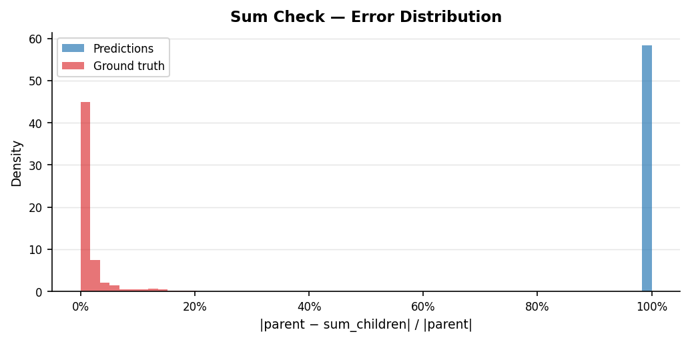
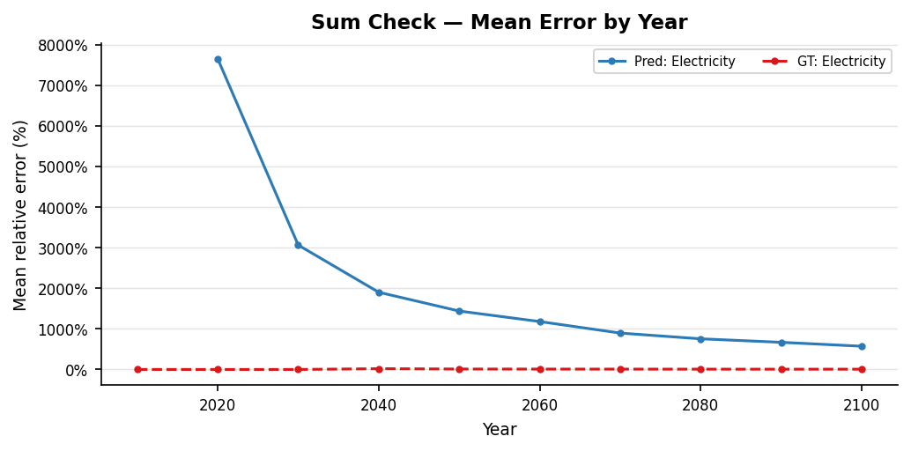
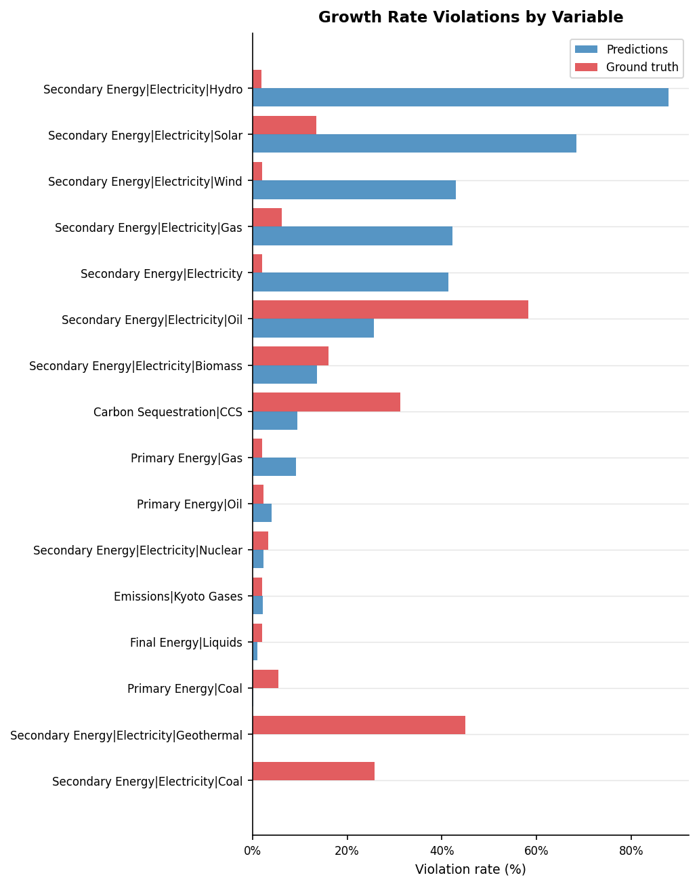
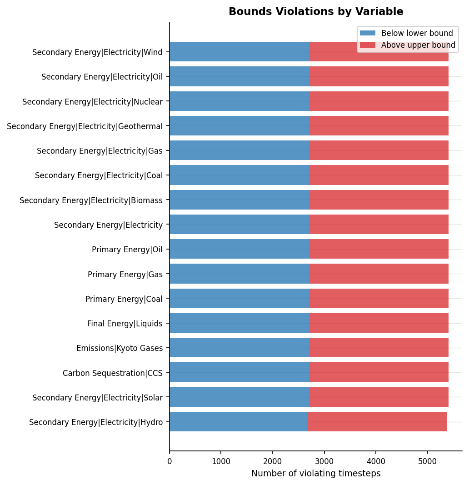
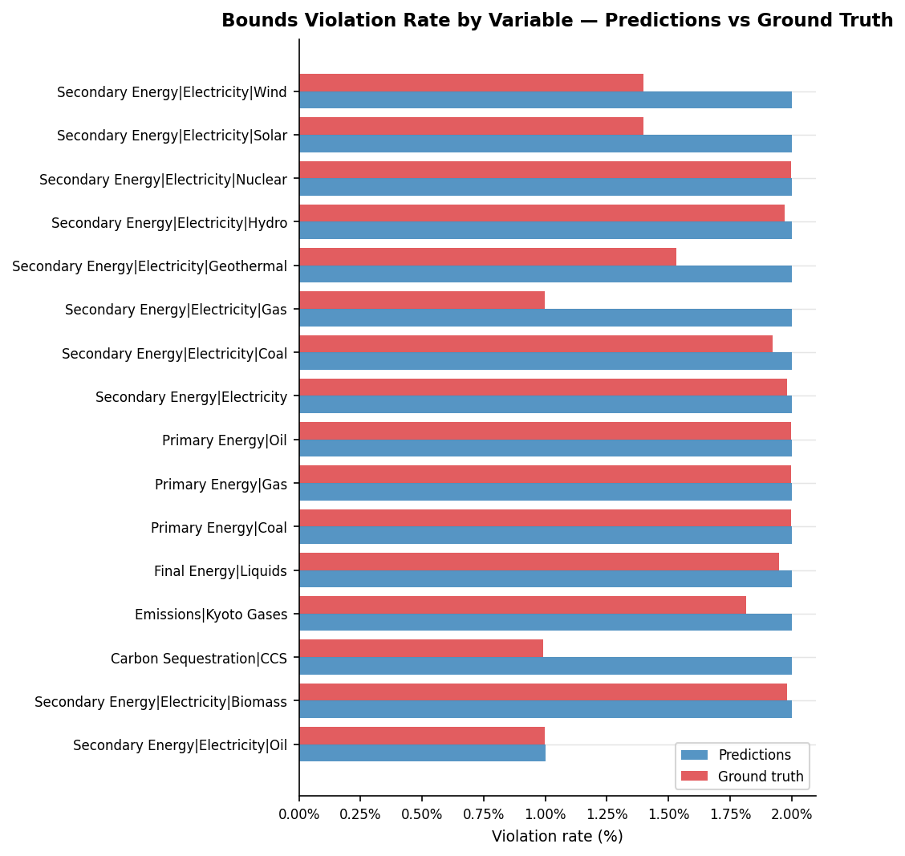
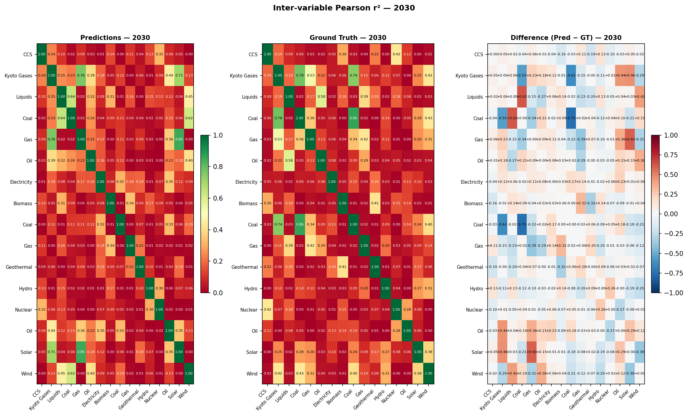
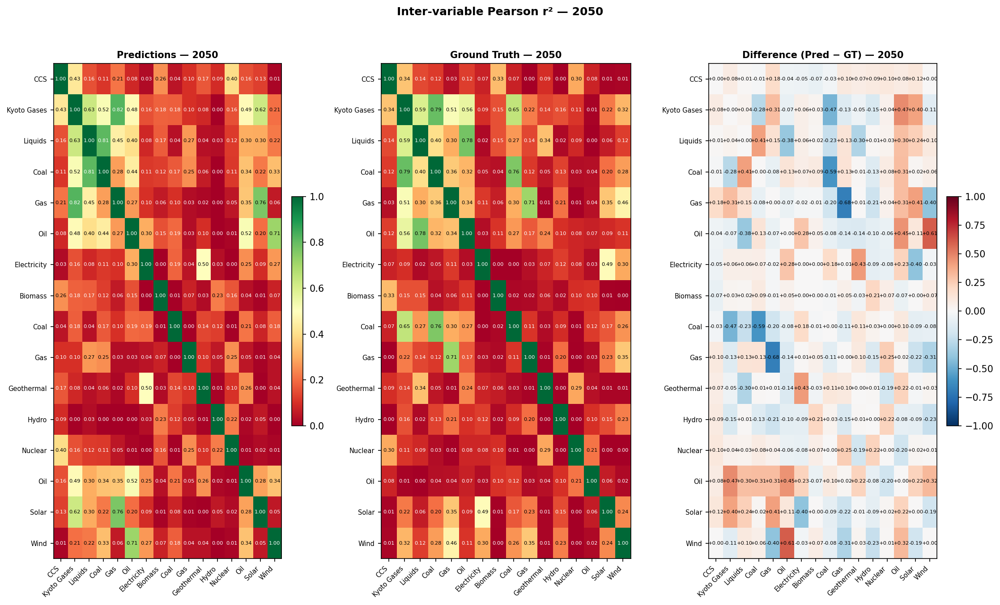
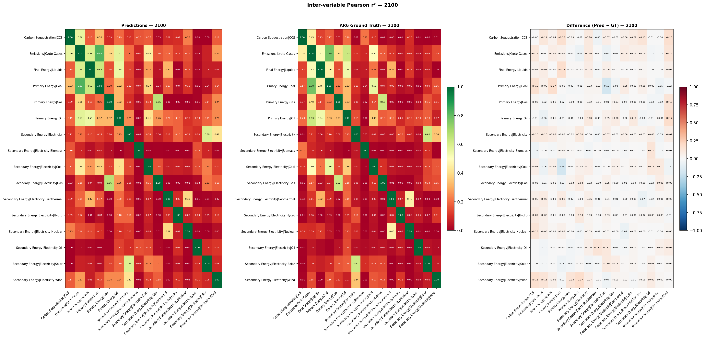

# Validation Report: li_vae_01

**Run ID:** `li_vae_01`
**Generated:** 2026-05-05 15:45
**Results:** `results/li_vae_01/`

---

## Overview

| Check | Metric | Predictions | Ground Truth |
| --- | --- | --- | --- |
| Hierarchy Sum Check | Scenario-region pass rate | 0.0% | 58.9% |
|  | Mean relative error | 2019.856% | 10.095% |
| Growth Rate Plausibility | Timestep violation rate | 21.9% | 11.5% |
| Physical Bounds Check | Timestep violation rate | 24.01% | 1.42% |
| Inter-variable Correlations | Mean \|Δr²\| vs ground truth | 0.1383 | 0.0000 (reference) |

---

## 1. Hierarchy Sum Check

_Checks that predicted parent variables equal the sum of their direct children
at every timestep. Predictions are **expected to fail** this check — the failure
rate quantifies how much the model violates IAM accounting identities._

### Pass Rates by Parent Variable

| Parent Variable | Scenario-regions | Pass rate (%) | Mean error (%) | Max error (%) |
| --- | --- | --- | --- | --- |
| Secondary Energy\|Electricity | 30000 | 0.0000 | 2019.8564 | 44942.0074 |

### Error Distribution

### Mean Error by Year

### Error Percentile Comparison — Predictions vs Ground Truth

| Percentile | Predictions (%) | Ground truth (%) |
| --- | --- | --- |
| p50 | 1495.9180 | 0.8424 |
| p75 | 2251.1809 | 1.8139 |
| p90 | 3837.0541 | 3.3668 |
| p95 | 5033.2191 | 5.8508 |
| p99 | 8124.1684 | 11.4583 |

---

## 2. Growth Rate Plausibility

_For each predicted trajectory, checks that period-on-period growth rates
fall within empirically-derived bounds from the ground truth data._

**Total timesteps evaluated:** 3,840,000  
**Violations:** 841,261 (21.91%)  

**Ground truth — violation rate:** 11.54%  
_(+10.37pp difference: predictions vs ground truth)_

### Violation Rate by Variable

### Violation Rate by Scenario Category

| Category | Timesteps | Violations | Violation rate (%) |
| --- | --- | --- | --- |
| C1234 | 1280000 | 301610 | 23.5600 |
| C56 | 1280000 | 278908 | 21.7900 |
| C78 | 1280000 | 260743 | 20.3700 |

---

## 3. Regional Consistency

_Checks that predicted World values equal the sum of predicted subregion values
(R5 / R6 / R10 groupings). Only applicable to datasets with regional breakdowns._

_Regional consistency results not found. Run `validate.py` first, or skip if your run has no multi-region scenarios._

---

## 4. Physical Bounds Check

_Checks predictions against hard physical lower bounds (energy variables ≥ 0)
and empirical per-variable bounds derived from ground truth._

**Timesteps checked:** 4,320,000  
**Violations:** 1,037,278 (24.011%)  
**Fully clean scenario-regions:** 332,609 / 480,000

### Violations by Variable

### Predictions vs Ground Truth

| Source | Timesteps | Violations | Violation rate |
| --- | --- | --- | --- |
| Predictions | 4,320,000 | 1,037,278 | 24.011% |
| Ground truth | 228,266 | 3,238 | 1.419% |

_Predictions show +22.593 pp more violations than ground truth._

### Violation Rate by Variable — Predictions vs Ground Truth

---

## 5. Hard Historical Constraints

_Checks World-level predictions at 2020 against AR6 vetting reference values
(Nicholls et al. 2022, Table 11). PASS = within IP range, WARN = within outer
tolerance, FAIL = outside outer tolerance. Belongs to the **historical and
domain knowledge comparison** validation family._

| Sub-check | N | Pass (%) | Warn (%) | Fail (%) | GT Pass (%) | GT Fail (%) |
| --- | --- | --- | --- | --- | --- | --- |
| ccs_2020 | 30000 | 96.7000 | 3.0000 | 0.2000 | 99.7000 | 0.3000 |

_Skipped sub-checks (required variables absent): co2_eip_2020: ['Emissions|CO2'], ch4_2020: ['Emissions|CH4'], co2_change_2010_2020: ['Emissions|CO2'], primary_energy_2020: ['Primary Energy'], nuclear_energy_2020: ['Primary Energy|Nuclear'], solar_wind_2020: ['Primary Energy|Solar', 'Primary Energy|Wind']_

---

## 6. Soft Future Constraints

_Checks World-level predictions at 2030–2040 against domain-knowledge
plausibility bounds from the AR6 vetting process (Table 11). Belongs to the
**historical and domain knowledge comparison** validation family._

| Sub-check | N | Pass (%) | Fail (%) | GT Pass (%) | GT Fail (%) |
| --- | --- | --- | --- | --- | --- |
| ccs_2030 | 30000 | 95.4000 | 4.6000 | 91.3000 | 8.7000 |
| nuclear_electricity_2030 | 30000 | 97.8000 | 2.2000 | 94.1000 | 5.9000 |

_Skipped sub-checks (required variables absent): co2_not_negative_2030: ['Emissions|CO2'], ch4_2040: ['Emissions|CH4']_

---

## 7. Inter-variable Correlations

_Pearson r² between all variable pairs at years 2030, 2050, and 2100 — comparing
predictions against AR6 ground truth. A well-calibrated emulator should preserve
the correlations present in real IAM data. Methodology follows Li et al. (2025) Fig. 4._

Inter-variable Pearson r² matrices at years 2030, 2050, and 2100, comparing model predictions against AR6 ground truth. Values close to the ground truth indicate the emulator preserves real-world variable relationships. Methodology follows Li et al. (2025) Fig. 4.

### 2030

_Left: predictions. Centre: AR6 ground truth. Right: difference (blue = predictions underestimate correlation, red = overestimate)._

### 2050

_Left: predictions. Centre: AR6 ground truth. Right: difference (blue = predictions underestimate correlation, red = overestimate)._

### 2100

_Left: predictions. Centre: AR6 ground truth. Right: difference (blue = predictions underestimate correlation, red = overestimate)._

### Summary: Mean Absolute Difference in r²

_Average absolute difference between predictions and ground truth correlation matrices (off-diagonal pairs only). Lower is better._

| Year | N variables | Mean \|Δr²\| (off-diagonal) |
| --- | --- | --- |
| 2030.0 | 16.0 | 0.146 |
| 2050.0 | 16.0 | 0.1468 |
| 2100.0 | 16.0 | 0.122 |

