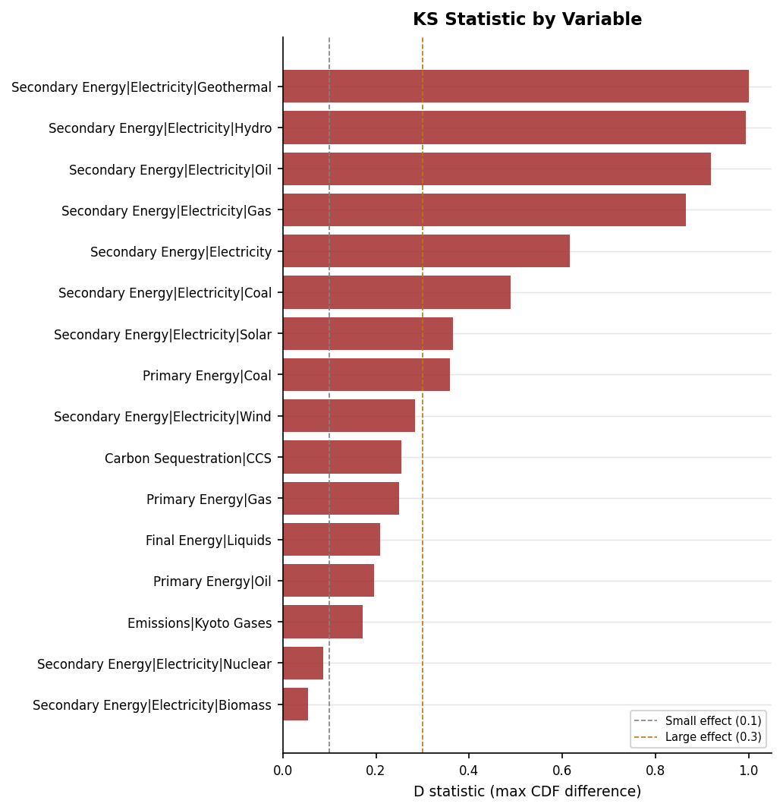
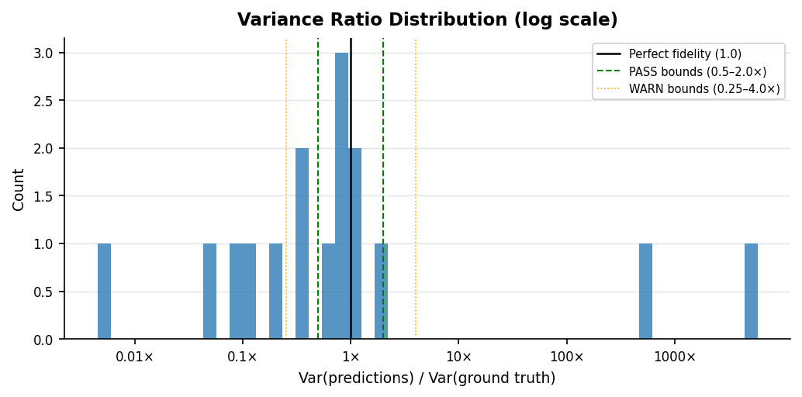
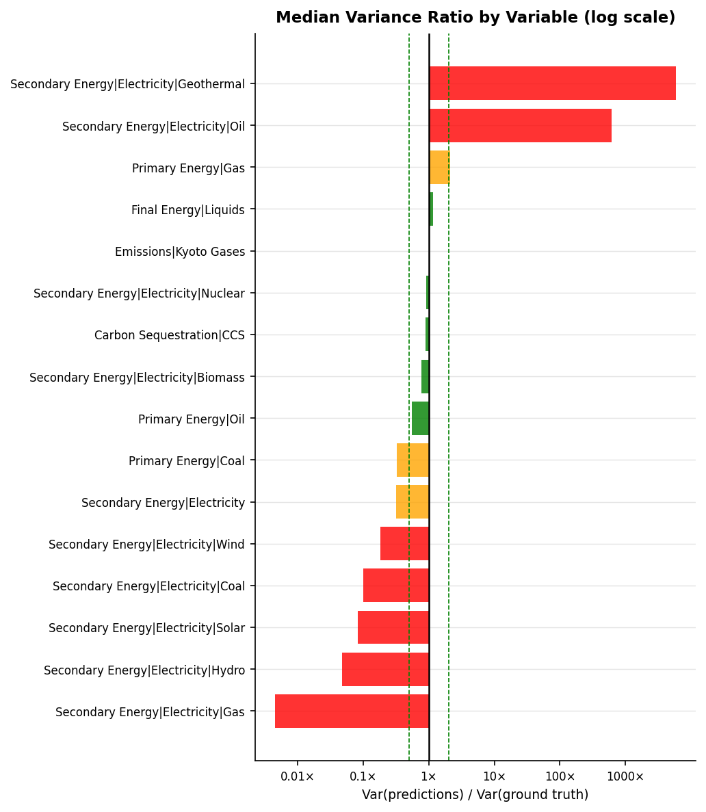

# Validation Report: li_vae_01

**Run ID:** `li_vae_01`
**Generated:** 2026-05-13 10:25
**Results:** `results/li_vae_01/`

---

## Overview

**1. Hierarchy Sum Check**

| Metric | Predictions | Ground Truth |
| --- | --- | --- |
| Pass rate | 0.0% | 58.9% |
| Mean relative error | 2019.856% | 10.095% |

**2. Growth Rate Plausibility**

| Metric | Predictions | Ground Truth |
| --- | --- | --- |
| Pass rate (timesteps) | 78.1% | 88.5% |

**3. Regional Consistency**

_No complete regional groupings in this dataset._

**4. Physical Bounds Check**

| Metric | Predictions | Ground Truth |
| --- | --- | --- |
| Pass rate (timesteps) | 76.0% | 98.5% |

**5. Hard Historical Constraints** _(PASS = within IP range, WARN = within outer tolerance)_

| Sub-check | Pass (%) | Warn (%) | Fail (%) | GT Pass (%) | GT Warn (%) | GT Fail (%) |
| --- | --- | --- | --- | --- | --- | --- |
| ccs_2020 | 96.7% | 3.0% | 0.2% | 98.2% | 1.4% | 0.3% |

**6. Soft Future Constraints**

| Sub-check | Pass (%) | Fail (%) | GT Pass (%) | GT Fail (%) |
| --- | --- | --- | --- | --- |
| ccs_2030 | 95.3% | 4.7% | 91.3% | 8.7% |
| nuclear_electricity_2030 | 97.8% | 2.2% | 94.1% | 5.9% |

**8. Inter-variable Correlations**

| Metric | Predictions | Ground Truth |
| --- | --- | --- |
| Mean \|Δr²\| vs ground truth | 0.1383 | 0.0000 (reference) |

**9. KS Distributional Test**

| Metric | Value |
| --- | --- |
| Mean D statistic | 0.4447 |
| Variables failing (corrected) | 16 / 16 |

**10. Variance Fidelity**

| Metric | Value |
| --- | --- |
| Median variance ratio | 0.6643 |
| Pass rate (variable-regions) | 37.5% |

---

## 1. Hierarchy Sum Check

_Checks that predicted parent variables equal the sum of their direct children
at every timestep. Predictions are **expected to fail** this check — the failure
rate quantifies how much the model violates IAM accounting identities._

### Pass Rates by Parent Variable

| Parent Variable | Scenario-regions | Pass rate (%) | Mean error (%) | Max error (%) |
| --- | --- | --- | --- | --- |
| Secondary Energy\|Electricity | 30000 | 0.0000 | 2019.8564 | 44942.0074 |

### Error Distribution

### Mean Error by Year

### Error Percentile Comparison — Predictions vs Ground Truth

| Percentile | Predictions (%) | Ground truth (%) |
| --- | --- | --- |
| p50 | 1495.9180 | 0.8424 |
| p75 | 2251.1809 | 1.8139 |
| p90 | 3837.0541 | 3.3668 |
| p95 | 5033.2191 | 5.8508 |
| p99 | 8124.1684 | 11.4583 |

### Example Failure

_The median failing scenario (by mean error) is shown below._

#### Example failure — predictions

**Scenario:** VAE | gen_00564 | World  
**Parent variable:** Secondary Energy|Electricity  
**Mean error:** 1495.91%  (median failing scenario)

| Year | Biomass | Coal | Gas | Geothermal | Hydro | Nuclear | Oil | Solar | Wind | Sum of children | Parent value | Error (%) | Status |
| --- | --- | --- | --- | --- | --- | --- | --- | --- | --- | --- | --- | --- | --- |
| 2020 | 0.925 | 14.262 | 0.356 | 98.92 | 1.134 | 9.679 | 5.007 | 30.298 | 33.192 | 193.773 | 2.437 | 7852.31 | FAIL |
| 2030 | 2.71 | 21.842 | 2.067 | 139.837 | 0.658 | 17.451 | 29.438 | 8.101 | 43.212 | 265.316 | 14.544 | 1724.26 | FAIL |
| 2040 | 2.607 | 24.43 | 5.013 | 218.944 | 0.23 | 26.204 | 61.463 | 6.767 | 54.595 | 400.253 | 29.574 | 1253.41 | FAIL |
| 2050 | 5.053 | 26.135 | 6.368 | 283.121 | 0.015 | 36.92 | 95.815 | 2.212 | 47.566 | 503.205 | 61.003 | 724.88 | FAIL |
| 2060 | 8.702 | 27.015 | 6.183 | 360.243 | 0.002 | 48.977 | 147.844 | 0.482 | 23.297 | 622.745 | 93.905 | 563.16 | FAIL |
| 2070 | 7.873 | 27.382 | 6.328 | 449.639 | 0.001 | 61.345 | 198.231 | 0.07 | 6.534 | 757.403 | 138.044 | 448.67 | FAIL |
| 2080 | 7.015 | 27.89 | 6.305 | 537.763 | 0.0 | 78.756 | 224.607 | 0.012 | 2.307 | 884.654 | 186.446 | 374.48 | FAIL |
| 2090 | 7.167 | 28.42 | 6.357 | 617.081 | 0.0 | 82.924 | 238.591 | 0.018 | 1.418 | 981.976 | 249.8 | 293.1 | FAIL |
| 2100 | 6.954 | 30.01 | 6.44 | 695.818 | 0.0 | 78.719 | 247.571 | 0.019 | 0.49 | 1066.019 | 324.121 | 228.9 | FAIL |

#### Example failure — ground truth

**Scenario:** REMIND-MAgPIE 2.1-4.2 | EN_NPi2020_1000_COV | World  
**Parent variable:** Secondary Energy|Electricity  
**Mean error:** 2.13%  (median failing scenario)

| Year | Biomass | Coal | Gas | Geothermal | Hydro | Nuclear | Oil | Solar | Wind | Sum of children | Parent value | Error (%) | Status |
| --- | --- | --- | --- | --- | --- | --- | --- | --- | --- | --- | --- | --- | --- |
| 2010 | 1.195 | 30.167 | 18.091 | 0.325 | 12.741 | 9.547 | 3.646 | 0.298 | 2.046 | 78.055 | 78.055 | 0.0 | PASS |
| 2020 | 2.085 | 30.63 | 22.894 | 0.872 | 19.519 | 8.022 | 2.12 | 3.386 | 5.484 | 95.013 | 95.024 | 0.01 | PASS |
| 2030 | 2.811 | 18.38 | 26.784 | 1.319 | 23.104 | 7.132 | 0.523 | 28.017 | 21.927 | 129.996 | 130.736 | 0.57 | PASS |
| 2040 | 2.721 | 0.506 | 18.014 | 1.336 | 25.322 | 7.254 | 0.02 | 58.072 | 57.697 | 170.943 | 174.113 | 1.82 | FAIL |
| 2050 | 2.836 | 0.019 | 9.687 | 1.312 | 26.881 | 6.952 | 0.0 | 85.272 | 97.497 | 230.456 | 236.125 | 2.4 | FAIL |
| 2060 | 3.924 | 0.008 | 7.802 | 1.276 | 28.131 | 6.085 | 0.0 | 114.508 | 131.631 | 293.366 | 301.445 | 2.68 | FAIL |
| 2070 | 5.423 | 0.013 | 8.919 | 1.252 | 29.082 | 5.281 | 0.0 | 147.842 | 159.81 | 357.622 | 368.555 | 2.97 | FAIL |
| 2080 | 6.729 | 0.025 | 9.78 | 1.233 | 29.834 | 4.884 | 0.0 | 180.22 | 177.243 | 409.948 | 423.964 | 3.31 | FAIL |
| 2090 | 7.568 | 0.032 | 9.855 | 1.183 | 30.648 | 5.882 | 0.0 | 205.703 | 192.284 | 453.154 | 470.327 | 3.65 | FAIL |
| 2100 | 8.195 | 0.03 | 9.835 | 1.23 | 31.316 | 8.621 | 0.0 | 232.592 | 207.765 | 499.583 | 519.97 | 3.92 | FAIL |

---

## 2. Growth Rate Plausibility

_For each predicted trajectory, checks that period-on-period growth rates
fall within empirically-derived bounds from the ground truth data._

**Total timesteps evaluated:** 3,840,000  
**Violations:** 841,261 (21.91%)  

**Ground truth — violation rate:** 11.54%  
_(+10.37pp difference: predictions vs ground truth)_

### Violation Rate by Variable

### Example Violation

_The most extreme growth rate violation is shown below._

#### Example violation — predictions

**Most extreme growth rate violation**

| Variable | Scenario | Region | Year (from) | Year (to) | Growth rate |
| --- | --- | --- | --- | --- | --- |
| Emissions\|Kyoto Gases | gen_13214 | World | 2090 | 2100 | -2974.3899 |

#### Example violation — ground truth

**Most extreme growth rate violation**

| Variable | Scenario | Region | Year (from) | Year (to) | Growth rate |
| --- | --- | --- | --- | --- | --- |
| Carbon Sequestration\|CCS | R2p1_SSP5-PkBudg900 | World | 2020 | 2030 | +1083.6932 |

---

## 3. Regional Consistency

_Checks that predicted World values equal the sum of predicted subregion values
(R5 / R6 / R10 groupings). Only applicable to datasets with regional breakdowns._

_No complete regional groupings found in this dataset. The check requires all subregions in a grouping (R5/R6/R10) to have data for the same scenario-variable-year combinations. This dataset has partial regional coverage only._

---

## 4. Physical Bounds Check

_Checks predictions against hard physical lower bounds (energy variables ≥ 0)
and empirical per-variable bounds derived from ground truth._

**Timesteps checked:** 4,320,000  
**Violations:** 1,037,278 (24.011%)  
**Fully clean scenario-regions:** 332,609 / 480,000

### Violations by Variable

### Predictions vs Ground Truth

| Source | Timesteps | Violations | Violation rate |
| --- | --- | --- | --- |
| Predictions | 4,320,000 | 1,037,278 | 24.011% |
| Ground truth | 222,820 | 3,238 | 1.453% |

_Predictions show +22.558 pp more violations than ground truth._

### Violation Rate by Variable — Predictions vs Ground Truth

### Example Violation

_The most extreme bounds violation is shown below._

#### Example violation — predictions

**Most extreme bounds violation**

| Variable | Scenario | Region | Year | Value | Units | Violation type |
| --- | --- | --- | --- | --- | --- | --- |
| Emissions\|Kyoto Gases | gen_20075 | World | 2090 | 154553.6562 | MtCO2eq/yr | Above empirical upper bound (100010.08) |

#### Example violation — ground truth

**Most extreme bounds violation**

| Variable | Scenario | Region | Year | Value | Units | Violation type |
| --- | --- | --- | --- | --- | --- | --- |
| Emissions\|Kyoto Gases | SSP5-Baseline | World | 2080 | 155970.0094 | MtCO2eq/yr | Above empirical upper bound (100010.08) |

---

## 5. Hard Historical Constraints

_Checks World-level predictions at 2020 against AR6 vetting reference values
(Nicholls et al. 2022, Table 11). PASS = within IP range, WARN = within outer
tolerance, FAIL = outside outer tolerance. Belongs to the **historical and
domain knowledge comparison** validation family._

| Sub-check | N | Pass (%) | Warn (%) | Fail (%) | GT Pass (%) | GT Fail (%) |
| --- | --- | --- | --- | --- | --- | --- |
| ccs_2020 | 30000 | 96.7000 | 3.0000 | 0.2000 | 99.7000 | 0.3000 |

_Skipped sub-checks (required variables absent): co2_eip_2020: ['Emissions|CO2'], ch4_2020: ['Emissions|CH4'], co2_change_2010_2020: ['Emissions|CO2'], primary_energy_2020: ['Primary Energy'], nuclear_energy_2020: ['Primary Energy|Nuclear'], solar_wind_2020: ['Primary Energy|Solar', 'Primary Energy|Wind']_

---

## 6. Soft Future Constraints

_Checks World-level predictions at 2030–2040 against domain-knowledge
plausibility bounds from the AR6 vetting process (Table 11). Belongs to the
**historical and domain knowledge comparison** validation family._

| Sub-check | N | Pass (%) | Fail (%) | GT Pass (%) | GT Fail (%) |
| --- | --- | --- | --- | --- | --- |
| ccs_2030 | 30000 | 95.4000 | 4.6000 | 91.3000 | 8.7000 |
| nuclear_electricity_2030 | 30000 | 97.8000 | 2.2000 | 94.1000 | 5.9000 |

_Skipped sub-checks (required variables absent): co2_not_negative_2030: ['Emissions|CO2'], ch4_2040: ['Emissions|CH4']_

---

## 7. SCI Vetting Checks

_Scenario vetting criteria from Verpoort et al. (2025), the IAMC's published
successor to the AR6 vetting criteria. Checks CO₂ EIP against CEDS-2025 data
at four anchor years (2010–2025), and CCS feasibility at 2030, 2035, and 2040.
Status: PASS = within medium-concern bounds, WARN = within strong-concern bounds,
FAIL = outside strong-concern (exclusion-level) bounds._

_Verpoort constraints results not found. Run `validate.py` first._

---

## 8. Inter-variable Correlations

_Pearson r² between all variable pairs at years 2030, 2050, and 2100 — comparing
predictions against AR6 ground truth. A well-calibrated emulator should preserve
the correlations present in real IAM data. Methodology follows Li et al. (2025) Fig. 4._

Inter-variable Pearson r² matrices at years 2030, 2050, and 2100, comparing model predictions against AR6 ground truth. Values close to the ground truth indicate the emulator preserves real-world variable relationships. Methodology follows Li et al. (2025) Fig. 4.

### 2030

_Left: predictions. Centre: AR6 ground truth. Right: difference (blue = predictions underestimate correlation, red = overestimate)._

### 2050

_Left: predictions. Centre: AR6 ground truth. Right: difference (blue = predictions underestimate correlation, red = overestimate)._

### 2100

_Left: predictions. Centre: AR6 ground truth. Right: difference (blue = predictions underestimate correlation, red = overestimate)._

### Summary: Mean Absolute Difference in r²

_Average absolute difference between predictions and ground truth correlation matrices (off-diagonal pairs only). Lower is better._

| Year | N variables | Mean \|Δr²\| (off-diagonal) |
| --- | --- | --- |
| 2030.0 | 16.0 | 0.146 |
| 2050.0 | 16.0 | 0.1468 |
| 2100.0 | 16.0 | 0.122 |

---

## 9. KS Distributional Test

_Two-sample Kolmogorov-Smirnov test comparing the full distribution of emulator
outputs against IAM ground truth per variable. The D statistic is the maximum
absolute gap between the two empirical CDFs — it captures distributional differences
in shape, skewness, and modality that mean- or variance-level checks miss. p-values
are Bonferroni-corrected across all variables to control the familywise error rate._

**Variables tested:** 16  
**Bonferroni-corrected α:** 0.003125  
**PASS:** 0 &nbsp; **FAIL:** 16  
**Mean D statistic:** 0.4447  
_D < 0.1 = negligible, 0.1–0.3 = small, ≥ 0.3 = large effect._

### Per-variable Results

_Sorted by D statistic descending. p-values are Bonferroni-corrected._

| Variable | D statistic | p (corrected) | Effect size | Status |
| --- | --- | --- | --- | --- |
| Secondary Energy\|Electricity\|Geothermal | 1.0000 | 0.0000 | large | FAIL |
| Secondary Energy\|Electricity\|Hydro | 0.9943 | 0.0000 | large | FAIL |
| Secondary Energy\|Electricity\|Oil | 0.9195 | 0.0000 | large | FAIL |
| Secondary Energy\|Electricity\|Gas | 0.8654 | 0.0000 | large | FAIL |
| Secondary Energy\|Electricity | 0.6163 | 0.0000 | large | FAIL |
| Secondary Energy\|Electricity\|Coal | 0.4894 | 0.0000 | large | FAIL |
| Secondary Energy\|Electricity\|Solar | 0.3646 | 0.0000 | large | FAIL |
| Primary Energy\|Coal | 0.3596 | 0.0000 | large | FAIL |
| Secondary Energy\|Electricity\|Wind | 0.2846 | 0.0000 | small | FAIL |
| Carbon Sequestration\|CCS | 0.2550 | 0.0000 | small | FAIL |
| Primary Energy\|Gas | 0.2491 | 0.0000 | small | FAIL |
| Final Energy\|Liquids | 0.2096 | 0.0000 | small | FAIL |
| Primary Energy\|Oil | 0.1956 | 0.0000 | small | FAIL |
| Emissions\|Kyoto Gases | 0.1719 | 0.0000 | small | FAIL |
| Secondary Energy\|Electricity\|Nuclear | 0.0864 | 0.0000 | negligible | FAIL |
| Secondary Energy\|Electricity\|Biomass | 0.0538 | 0.0000 | negligible | FAIL |

### D Statistic by Variable

_Green = PASS, red = FAIL (Bonferroni-corrected). D measures the maximum gap between the emulator and IAM CDFs — larger values indicate greater distributional divergence._

---

## 10. Variance Fidelity

_Checks whether the emulator reproduces the marginal variance of each output
variable. Inter-variable correlation checks preserve the shape of variable
relationships but normalise out variance — this check catches whether the
emulator is systematically over- or under-dispersed. Variance ratio =
Var(predictions) / Var(ground truth); a well-calibrated emulator should be
close to 1.0. Applicable to both reconstruction and generative runs._

**Variable-region pairs evaluated:** 16  
**Skipped** (near-constant GT): 0  
**PASS:** 6 &nbsp; **WARN:** 3 &nbsp; **FAIL:** 7  
_PASS = variance ratio within 0.5–2.0×; WARN = 0.25–0.5× or 2.0–4.0×; FAIL = outside 4×._

### Per-variable Summary

_Median variance ratio and CV ratio across regions. Values below 1.0 indicate the emulator is under-dispersed; above 1.0 it is over-dispersed._

| Variable | Var Ratio | CV Ratio | Pass Rate | Warn Rate | Fail Rate |
| --- | --- | --- | --- | --- | --- |
| Secondary Energy\|Electricity\|Gas | 0.0045 | 1.1163 | 0.0000 | 0.0000 | 1.0000 |
| Secondary Energy\|Electricity\|Hydro | 0.0474 | 4.8995 | 0.0000 | 0.0000 | 1.0000 |
| Secondary Energy\|Electricity\|Solar | 0.0833 | 0.9139 | 0.0000 | 0.0000 | 1.0000 |
| Secondary Energy\|Electricity\|Coal | 0.1000 | 0.2552 | 0.0000 | 0.0000 | 1.0000 |
| Secondary Energy\|Electricity\|Wind | 0.1831 | 0.8061 | 0.0000 | 0.0000 | 1.0000 |
| Secondary Energy\|Electricity | 0.3150 | 1.8258 | 0.0000 | 1.0000 | 0.0000 |
| Primary Energy\|Coal | 0.3217 | 0.4032 | 0.0000 | 1.0000 | 0.0000 |
| Primary Energy\|Oil | 0.5527 | 0.6201 | 1.0000 | 0.0000 | 0.0000 |
| Secondary Energy\|Electricity\|Biomass | 0.7758 | 1.0229 | 1.0000 | 0.0000 | 0.0000 |
| Carbon Sequestration\|CCS | 0.8890 | 1.0995 | 1.0000 | 0.0000 | 0.0000 |
| Secondary Energy\|Electricity\|Nuclear | 0.9190 | 0.9953 | 1.0000 | 0.0000 | 0.0000 |
| Emissions\|Kyoto Gases | 1.0302 | 0.7888 | 1.0000 | 0.0000 | 0.0000 |
| Final Energy\|Liquids | 1.1486 | 0.9310 | 1.0000 | 0.0000 | 0.0000 |
| Primary Energy\|Gas | 2.1135 | 1.6017 | 0.0000 | 1.0000 | 0.0000 |
| Secondary Energy\|Electricity\|Oil | 607.1925 | 0.5730 | 0.0000 | 0.0000 | 1.0000 |
| Secondary Energy\|Electricity\|Geothermal | 5883.0719 | 0.5151 | 0.0000 | 0.0000 | 1.0000 |

### Variance Ratio Distribution

### Median Variance Ratio by Variable

_Log scale — green = PASS, orange = WARN, red = FAIL. Bars left of centre = under-dispersed; right = over-dispersed._

---

## 11. Reconstruction Error Metrics

_Applies to reconstruction emulators only (1:1 correspondence between predicted
and ground truth scenarios). Normalised RMSE (nRMSE = RMSE / mean|ground truth|)
is dimensionless and comparable across variables. The portrait plot shows performance
across all variable-region pairs simultaneously. The temporal drift chart diagnoses
autoregressive error accumulation over the projection horizon._

_Error metrics results not found. Run `validate.py` with `--method_type reconstruction` to generate them._

