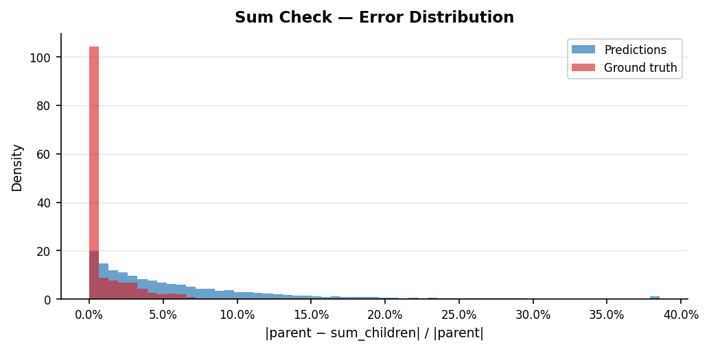
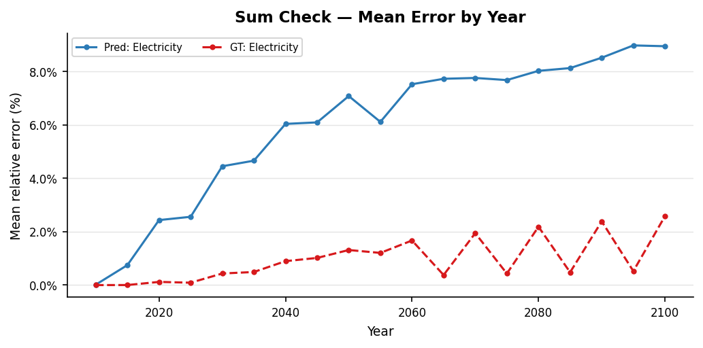
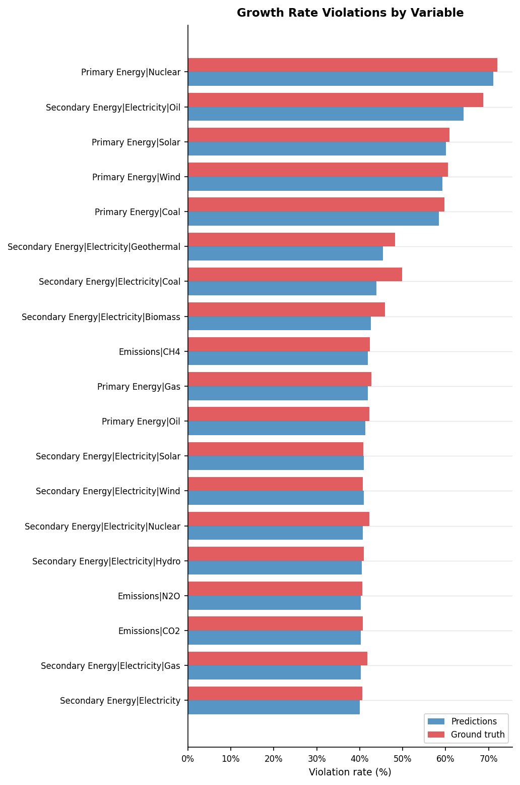
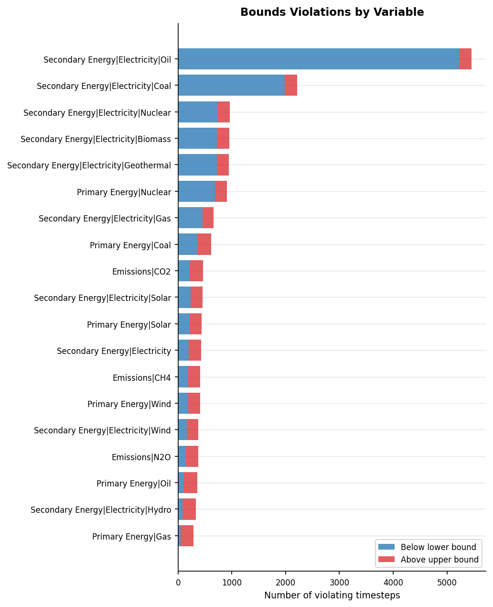
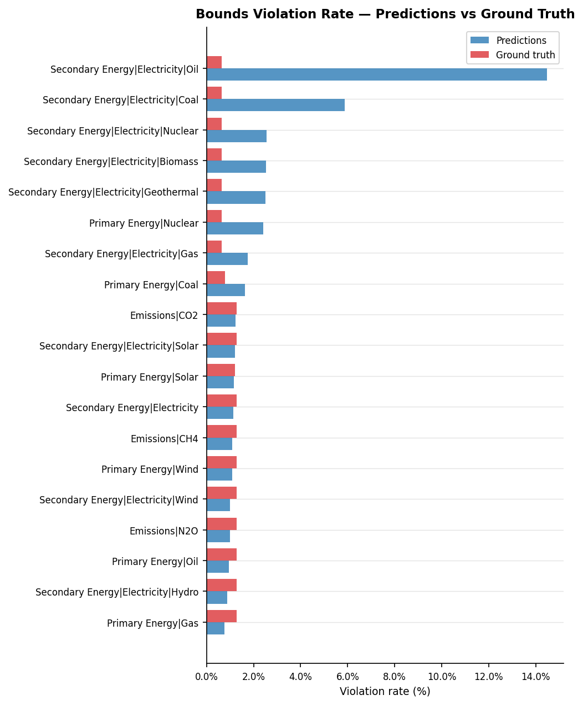
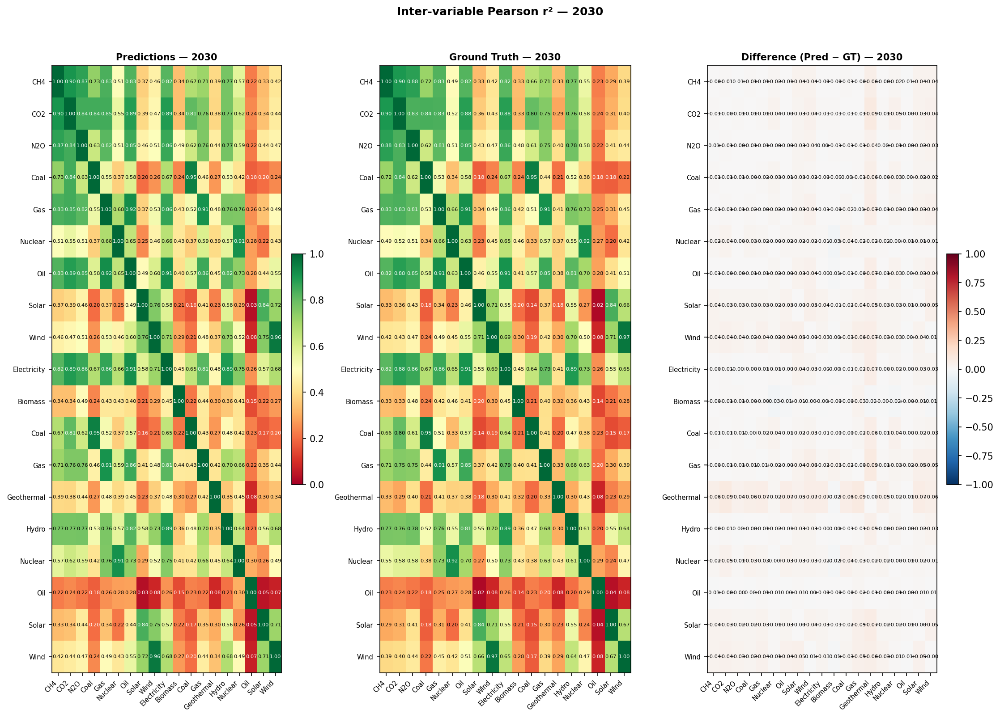
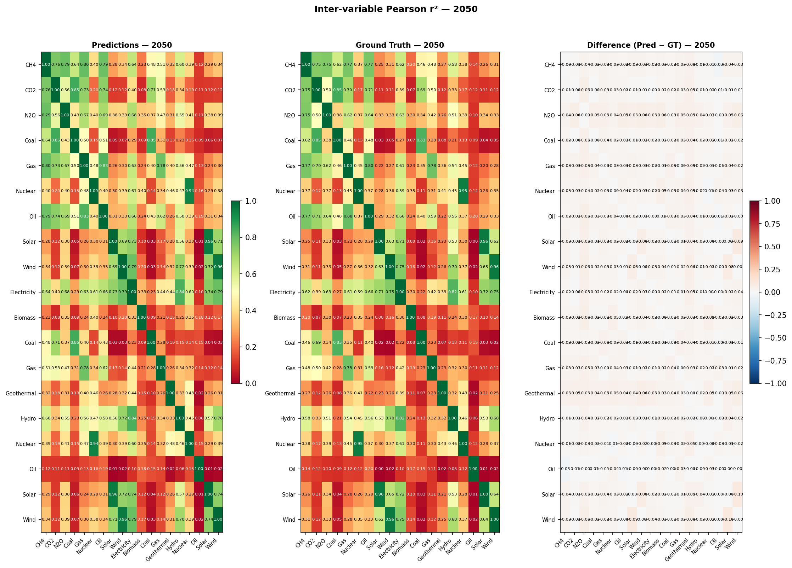
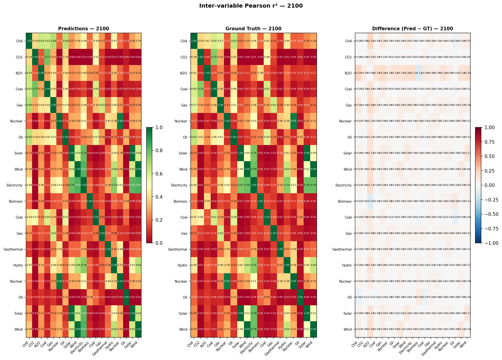
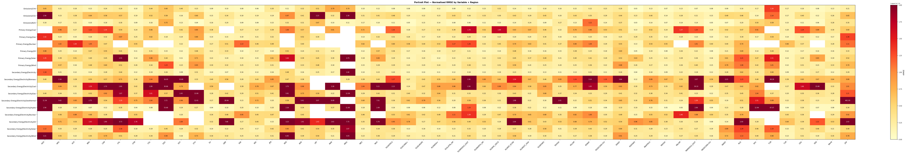
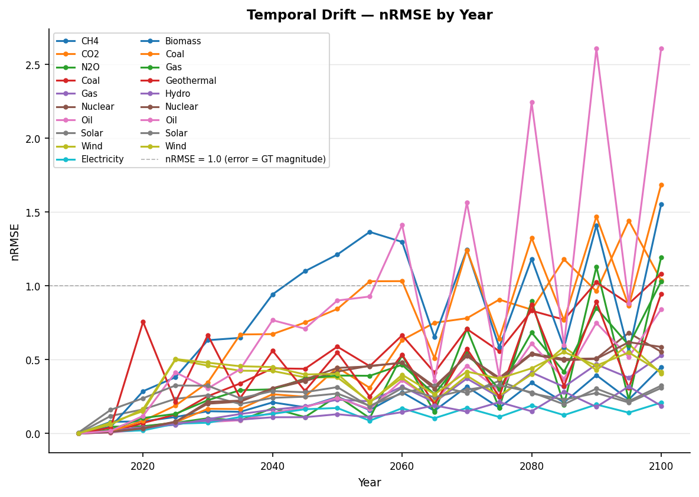

# Validation Report: shin_01

**Run ID:** `shin_01`
**Generated:** 2026-05-12 14:45
**Results:** `results/shin_01/`

---

## Overview

**1. Hierarchy Sum Check**

| Metric | Predictions | Ground Truth |
| --- | --- | --- |
| Pass rate | 1.3% | 66.4% |
| Mean relative error | 6.538% | 1.365% |

**2. Growth Rate Plausibility**

| Metric | Predictions | Ground Truth |
| --- | --- | --- |
| Pass rate (timesteps) | 53.0% | 51.5% |

**3. Regional Consistency**

_No complete regional groupings in this dataset._

**4. Physical Bounds Check**

| Metric | Predictions | Ground Truth |
| --- | --- | --- |
| Pass rate (timesteps) | 97.6% | 99.0% |

**5. Hard Historical Constraints** _(PASS = within IP range, WARN = within outer tolerance)_

| Sub-check | Pass (%) | Warn (%) | Fail (%) | GT Pass (%) | GT Warn (%) | GT Fail (%) |
| --- | --- | --- | --- | --- | --- | --- |
| ch4_2020 | 88.8% | 0.0% | 11.2% | 88.8% | 0.0% | 11.2% |
| co2_change_2010_2020 | 100.0% | 0.0% | 0.0% | 100.0% | 0.0% | 0.0% |
| co2_eip_2020 | 53.9% | 40.4% | 5.6% | 49.4% | 43.8% | 6.7% |
| nuclear_energy_2020 | 69.7% | 20.2% | 10.1% | 69.7% | 20.2% | 10.1% |
| solar_wind_2020 | 55.1% | 9.0% | 36.0% | 49.4% | 15.7% | 34.8% |

**6. Soft Future Constraints**

| Sub-check | Pass (%) | Fail (%) | GT Pass (%) | GT Fail (%) |
| --- | --- | --- | --- | --- |
| ch4_2040 | 99.2% | 0.8% | 99.2% | 0.8% |
| co2_not_negative_2030 | 100.0% | 0.0% | 100.0% | 0.0% |
| nuclear_electricity_2030 | 0.0% | 100.0% | 0.0% | 100.0% |

**8. Inter-variable Correlations**

| Metric | Predictions | Ground Truth |
| --- | --- | --- |
| Mean \|Δr²\| vs ground truth | 0.0277 | 0.0000 (reference) |

**9. Reconstruction Error Metrics**

| Metric | Value |
| --- | --- |
| Mean nRMSE | 523.0088 |
| Mean MAE | 275.2001 |
| Mean R² | -506976.5196 |
| Mean Bias | 7.4334 |

---

## 1. Hierarchy Sum Check

_Checks that predicted parent variables equal the sum of their direct children
at every timestep. Predictions are **expected to fail** this check — the failure
rate quantifies how much the model violates IAM accounting identities._

### Pass Rates by Parent Variable

| Parent Variable | Scenario-regions | Pass rate (%) | Mean error (%) | Max error (%) |
| --- | --- | --- | --- | --- |
| Secondary Energy\|Electricity | 1984 | 1.2601 | 6.5384 | 219.8757 |

### Error Distribution

### Mean Error by Year

### Error Percentile Comparison — Predictions vs Ground Truth

| Percentile | Predictions (%) | Ground truth (%) |
| --- | --- | --- |
| p50 | 5.0274 | 0.0025 |
| p75 | 7.9962 | 1.7538 |
| p90 | 12.1709 | 3.6437 |
| p95 | 16.4388 | 5.4734 |
| p99 | 27.9085 | 12.8627 |

### Example Failure

_The median failing scenario (by mean error) is shown below._

#### Example failure — predictions

**Scenario:** POLES ENGAGE | EN_INDCi2030_1000f_COV_NDCp | TUR  
**Parent variable:** Secondary Energy|Electricity  
**Mean error:** 5.07%  (median failing scenario)

| Year | Biomass | Coal | Gas | Geothermal | Hydro | Nuclear | Oil | Solar | Wind | Sum of children | Parent value | Error (%) | Status |
| --- | --- | --- | --- | --- | --- | --- | --- | --- | --- | --- | --- | --- | --- |
| 2025 | 10.822 | 257.648 | 319.528 | 18.343 | 427.783 | 0.035 | 6.393 | 54.959 | 224.102 | 1319.613 | 1358.654 | 2.87 | FAIL |
| 2030 | 13.231 | 265.38 | 340.77 | 21.043 | 494.357 | 4.613 | 8.081 | 141.097 | 325.506 | 1614.078 | 1661.869 | 2.88 | FAIL |
| 2035 | 24.008 | 164.943 | 332.073 | 41.809 | 567.413 | 19.207 | 11.083 | 320.571 | 503.258 | 1984.364 | 1907.483 | 4.03 | FAIL |
| 2040 | 28.477 | 95.003 | 271.475 | 101.358 | 599.566 | 52.734 | 9.3 | 509.282 | 683.582 | 2350.778 | 2329.942 | 0.89 | PASS |
| 2045 | 47.279 | 76.425 | 222.682 | 157.881 | 601.505 | 75.889 | 5.824 | 603.128 | 903.232 | 2693.845 | 2785.21 | 3.28 | FAIL |
| 2050 | 73.653 | 65.346 | 191.038 | 190.944 | 613.918 | 133.621 | 4.096 | 779.486 | 1087.976 | 3140.077 | 3267.89 | 3.91 | FAIL |
| 2060 | 123.204 | 60.312 | 163.412 | 226.237 | 609.848 | 253.163 | 1.7 | 940.295 | 1351.034 | 3729.205 | 3853.846 | 3.23 | FAIL |
| 2070 | 148.595 | 63.065 | 105.138 | 234.01 | 612.08 | 367.124 | 2.147 | 1008.708 | 1339.211 | 3880.078 | 4165.657 | 6.86 | FAIL |
| 2080 | 181.048 | 62.515 | 78.949 | 230.836 | 614.795 | 461.569 | 1.364 | 963.684 | 1212.894 | 3807.653 | 4229.573 | 9.98 | FAIL |
| 2090 | 204.621 | 65.03 | 57.511 | 240.202 | 618.833 | 451.501 | 1.818 | 910.13 | 1176.593 | 3726.239 | 4112.924 | 9.4 | FAIL |
| 2100 | 195.279 | 59.552 | 36.68 | 269.176 | 615.787 | 449.037 | 1.278 | 828.325 | 1110.948 | 3566.062 | 3893.672 | 8.41 | FAIL |

#### Example failure — ground truth

**Scenario:** REMIND-MAgPIE 2.1-4.2 | EN_NPi2020_1000f_COV | R10MIDDLE_EAST  
**Parent variable:** Secondary Energy|Electricity  
**Mean error:** 2.63%  (median failing scenario)

| Year | Biomass | Coal | Gas | Geothermal | Hydro | Nuclear | Oil | Solar | Wind | Sum of children | Parent value | Error (%) | Status |
| --- | --- | --- | --- | --- | --- | --- | --- | --- | --- | --- | --- | --- | --- |
| 2015 | 0.0 | 206.3 | 4075.6 | 33.1 | 238.9 | 22.4 | 661.1 | 13.0 | 20.0 | 5270.4 | 5270.3 | 0.0 | PASS |
| 2020 | 3.9 | 102.9 | 4660.7 | 68.0 | 295.3 | 71.1 | 491.4 | 107.0 | 47.6 | 5847.9 | 5847.9 | 0.0 | PASS |
| 2025 | 17.8 | 16.8 | 4911.3 | 97.0 | 296.7 | 118.5 | 317.1 | 525.9 | 171.4 | 6472.5 | 6474.9 | 0.04 | PASS |
| 2030 | 28.2 | 14.5 | 4989.2 | 112.0 | 295.3 | 150.7 | 115.6 | 1535.1 | 488.5 | 7729.1 | 7749.2 | 0.26 | PASS |
| 2035 | 29.7 | 1.3 | 4408.0 | 112.0 | 293.3 | 170.3 | 0.0 | 2881.3 | 1151.1 | 9047.0 | 9126.0 | 0.87 | PASS |
| 2040 | 33.8 | 1.1 | 2891.7 | 111.9 | 291.2 | 178.7 | 0.0 | 4269.7 | 2327.6 | 10105.7 | 10288.0 | 1.77 | FAIL |
| 2045 | 43.1 | 0.7 | 1100.3 | 112.0 | 289.1 | 177.0 | 0.0 | 5631.5 | 4106.3 | 11460.0 | 11786.5 | 2.77 | FAIL |
| 2050 | 60.4 | 0.4 | 449.4 | 111.8 | 287.0 | 165.8 | 0.0 | 7086.2 | 6154.7 | 14315.7 | 14779.5 | 3.14 | FAIL |
| 2055 | 88.9 | 0.2 | 551.1 | 112.0 | 284.8 | 145.7 | 0.0 | 8598.3 | 8343.8 | 18124.8 | 18719.2 | 3.18 | FAIL |
| 2060 | 130.3 | 0.1 | 629.0 | 112.0 | 282.5 | 115.3 | 0.0 | 10188.3 | 10404.2 | 21861.7 | 22614.5 | 3.33 | FAIL |
| 2070 | 269.0 | 0.1 | 577.7 | 112.0 | 277.6 | 44.5 | 0.0 | 13208.5 | 13420.3 | 27909.7 | 29120.3 | 4.16 | FAIL |
| 2080 | 495.1 | 0.1 | 351.4 | 112.0 | 272.1 | 10.2 | 0.0 | 16472.2 | 15149.2 | 32862.3 | 34669.6 | 5.21 | FAIL |
| 2090 | 718.1 | 0.1 | 113.3 | 108.5 | 265.4 | 0.7 | 0.0 | 18670.7 | 16791.0 | 36667.8 | 38983.0 | 5.94 | FAIL |
| 2100 | 819.7 | 0.1 | 0.1 | 112.0 | 255.1 | 0.0 | 0.0 | 19949.2 | 17977.0 | 39113.2 | 41670.0 | 6.14 | FAIL |

---

## 2. Growth Rate Plausibility

_For each predicted trajectory, checks that period-on-period growth rates
fall within empirically-derived bounds from the ground truth data._

**Total timesteps evaluated:** 420,508  
**Violations:** 197,815 (47.04%)  

**Ground truth — violation rate:** 48.50%  
_(-1.46pp difference: predictions vs ground truth)_

### Violation Rate by Variable

### Example Violation

_The most extreme growth rate violation is shown below._

#### Example violation — predictions

**Most extreme growth rate violation**

| Variable | Scenario | Region | Year (from) | Year (to) | Growth rate |
| --- | --- | --- | --- | --- | --- |
| Secondary Energy\|Electricity\|Solar | EN_NPi2020_600_DR1p | R10MIDDLE_EAST | 2020 | 2025 | +478.8620 |

#### Example violation — ground truth

**Most extreme growth rate violation**

| Variable | Scenario | Region | Year (from) | Year (to) | Growth rate |
| --- | --- | --- | --- | --- | --- |
| Secondary Energy\|Electricity\|Wind | EN_INDCi2030_700 | R10MIDDLE_EAST | 2030 | 2035 | +327.1855 |

---

## 3. Regional Consistency

_Checks that predicted World values equal the sum of predicted subregion values
(R5 / R6 / R10 groupings). Only applicable to datasets with regional breakdowns._

_No complete regional groupings found in this dataset. The check requires all subregions in a grouping (R5/R6/R10) to have data for the same scenario-variable-year combinations. This dataset has partial regional coverage only._

---

## 4. Physical Bounds Check

_Checks predictions against hard physical lower bounds (energy variables ≥ 0)
and empirical per-variable bounds derived from ground truth._

**Timesteps checked:** 716,224  
**Violations:** 17,041 (2.379%)  
**Fully clean scenario-regions:** 32,149 / 37,696

### Violations by Variable

### Predictions vs Ground Truth

| Source | Timesteps | Violations | Violation rate |
| --- | --- | --- | --- |
| Predictions | 716,224 | 17,041 | 2.379% |
| Ground truth | 716,224 | 7,257 | 1.013% |

_Predictions show +1.366 pp more violations than ground truth._

### Violation Rate by Variable — Predictions vs Ground Truth

### Example Violation

_The most extreme bounds violation is shown below._

#### Example violation — predictions

**Most extreme bounds violation**

| Variable | Scenario | Region | Year | Value | Units | Violation type |
| --- | --- | --- | --- | --- | --- | --- |
| Secondary Energy\|Electricity | CEMICS-2.0-CDR8 | World | 2100 | 831072.3969 | EJ/yr | Above empirical upper bound (373710.01) |

#### Example violation — ground truth

**Most extreme bounds violation**

| Variable | Scenario | Region | Year | Value | Units | Violation type |
| --- | --- | --- | --- | --- | --- | --- |
| Secondary Energy\|Electricity | EN_NPi2020_600f | World | 2100 | 829450.1 | EJ/yr | Above empirical upper bound (373710.01) |

---

## 5. Hard Historical Constraints

_Checks World-level predictions at 2020 against AR6 vetting reference values
(Nicholls et al. 2022, Table 11). PASS = within IP range, WARN = within outer
tolerance, FAIL = outside outer tolerance. Belongs to the **historical and
domain knowledge comparison** validation family._

| Sub-check | N | Pass (%) | Warn (%) | Fail (%) | GT Pass (%) | GT Fail (%) |
| --- | --- | --- | --- | --- | --- | --- |
| ch4_2020 | 89 | 88.8000 | 0.0000 | 11.2000 | 88.8000 | 11.2000 |
| co2_change_2010_2020 | 18 | 100.0000 | 0.0000 | 0.0000 | 100.0000 | 0.0000 |
| co2_eip_2020 | 89 | 53.9000 | 40.4000 | 5.6000 | 88.0000 | 12.0000 |
| nuclear_energy_2020 | 89 | 69.7000 | 20.2000 | 10.1000 | 87.3000 | 12.7000 |
| solar_wind_2020 | 89 | 55.1000 | 9.0000 | 36.0000 | 58.7000 | 41.3000 |

_Skipped sub-checks (required variables absent): ccs_2020: ['Carbon Sequestration|CCS'], primary_energy_2020: ['Primary Energy']_

---

## 6. Soft Future Constraints

_Checks World-level predictions at 2030–2040 against domain-knowledge
plausibility bounds from the AR6 vetting process (Table 11). Belongs to the
**historical and domain knowledge comparison** validation family._

| Sub-check | N | Pass (%) | Fail (%) | GT Pass (%) | GT Fail (%) |
| --- | --- | --- | --- | --- | --- |
| ch4_2040 | 120 | 99.2000 | 0.8000 | 99.2000 | 0.8000 |
| co2_not_negative_2030 | 118 | 100.0000 | 0.0000 | 100.0000 | 0.0000 |
| nuclear_electricity_2030 | 118 | 0.0000 | 100.0000 | 0.0000 | 100.0000 |

_Skipped sub-checks (required variables absent): ccs_2030: ['Carbon Sequestration|CCS']_

⚠️ POSSIBLE UNIT MISMATCH: median 1.255e+04 is ~1046x higher than expected 12 EJ/yr. Check units for Secondary Energy|Electricity|Nuclear

---

## 7. SCI Vetting Checks

_Scenario vetting criteria from Verpoort et al. (2025), the IAMC's published
successor to the AR6 vetting criteria. Checks CO₂ EIP against CEDS-2025 data
at four anchor years (2010–2025), and CCS feasibility at 2030, 2035, and 2040.
Status: PASS = within medium-concern bounds, WARN = within strong-concern bounds,
FAIL = outside strong-concern (exclusion-level) bounds._

_Verpoort constraints results not found. Run `validate.py` first._

---

## 8. Inter-variable Correlations

_Pearson r² between all variable pairs at years 2030, 2050, and 2100 — comparing
predictions against AR6 ground truth. A well-calibrated emulator should preserve
the correlations present in real IAM data. Methodology follows Li et al. (2025) Fig. 4._

Inter-variable Pearson r² matrices at years 2030, 2050, and 2100, comparing model predictions against AR6 ground truth. Values close to the ground truth indicate the emulator preserves real-world variable relationships. Methodology follows Li et al. (2025) Fig. 4.

### 2030

_Left: predictions. Centre: AR6 ground truth. Right: difference (blue = predictions underestimate correlation, red = overestimate)._

### 2050

_Left: predictions. Centre: AR6 ground truth. Right: difference (blue = predictions underestimate correlation, red = overestimate)._

### 2100

_Left: predictions. Centre: AR6 ground truth. Right: difference (blue = predictions underestimate correlation, red = overestimate)._

### Summary: Mean Absolute Difference in r²

_Average absolute difference between predictions and ground truth correlation matrices (off-diagonal pairs only). Lower is better._

| Year | N variables | Mean \|Δr²\| (off-diagonal) |
| --- | --- | --- |
| 2030.0 | 19.0 | 0.0219 |
| 2050.0 | 19.0 | 0.0261 |
| 2100.0 | 19.0 | 0.035 |

---

## 9. Reconstruction Error Metrics

_Applies to reconstruction emulators only (1:1 correspondence between predicted
and ground truth scenarios). Normalised RMSE (nRMSE = RMSE / mean|ground truth|)
is dimensionless and comparable across variables. The portrait plot shows performance
across all variable-region pairs simultaneously. The temporal drift chart diagnoses
autoregressive error accumulation over the projection horizon._

### Overall

_Aggregated across all variables and regions._

| Metric | Value |
| --- | --- |
| Mean nRMSE | 523.0088 |
| Mean MAE | 275.2001 |
| Mean R² | -506976.5196 |
| Mean Bias | 7.4334 |

### Per-variable Summary

_Metrics averaged over all regions. nRMSE = RMSE / mean(|ground truth|) — dimensionless, comparable across variables. Lower is better._

| Variable | Units | nRMSE | RMSE | MAE | R2 | Bias |
| --- | --- | --- | --- | --- | --- | --- |
| Secondary Energy\|Electricity\|Coal | EJ/yr | 8692.6506 | 735.4322 | 275.0868 | -4515187.3978 | -10.7167 |
| Secondary Energy\|Electricity\|Nuclear | EJ/yr | 660.5368 | 931.0029 | 410.0177 | -3706023.4764 | 77.8554 |
| Primary Energy\|Nuclear | EJ | 182.7484 | 0.9637 | 0.4325 | 0.6033 | 0.0830 |
| Secondary Energy\|Electricity\|Hydro | EJ/yr | 168.6258 | 304.1664 | 150.3650 | -1113355.0781 | 0.9712 |
| Secondary Energy\|Electricity\|Oil | EJ/yr | 115.6841 | 53.7048 | 16.2562 | -122008.8536 | 3.8157 |
| Secondary Energy\|Electricity\|Biomass | EJ/yr | 80.4899 | 537.4479 | 200.1244 | -118153.0741 | 34.1752 |
| Secondary Energy\|Electricity\|Geothermal | EJ/yr | 29.1937 | 93.0242 | 31.5789 | -57775.2221 | 7.3822 |
| Primary Energy\|Coal | EJ | 2.0300 | 2.7643 | 1.2147 | -43.7133 | 0.0205 |
| Secondary Energy\|Electricity\|Gas | EJ/yr | 1.0675 | 936.2636 | 474.9392 | -8.5900 | -129.6940 |
| Secondary Energy\|Electricity\|Wind | EJ/yr | 0.6225 | 1806.7993 | 863.6720 | 0.0973 | 16.2055 |
| Primary Energy\|Wind | EJ | 0.6044 | 1.8232 | 0.8813 | 0.0093 | 0.0463 |
| Primary Energy\|Solar | EJ | 0.5604 | 2.0602 | 0.9986 | -0.3354 | 0.0842 |
| Primary Energy\|Gas | EJ | 0.4875 | 2.8792 | 1.6164 | -0.4568 | -0.2067 |
| Emissions\|CO2 | Mt CO2/yr | 0.4751 | 581.2167 | 304.1740 | 0.3081 | -4.6647 |
| Secondary Energy\|Electricity\|Solar | EJ/yr | 0.4184 | 1718.4093 | 836.6479 | 0.5380 | 22.8162 |
| Primary Energy\|Oil | EJ | 0.2877 | 2.3576 | 1.2073 | 0.5268 | -0.0812 |
| Secondary Energy\|Electricity | EJ/yr | 0.2552 | 3105.8114 | 1595.6261 | 0.5750 | 124.9341 |
| Emissions\|CH4 | Mt CH4/yr | 0.2266 | 3.2327 | 1.6861 | 0.4968 | 0.0240 |
| Emissions\|N2O | Mt N2O/yr | 0.2024 | 196.6245 | 62.2776 | -0.8303 | -1.8153 |

### Portrait Plot (Variable × Region)

_Normalised RMSE for each variable-region pair. nRMSE > 1.0 (dark red) means prediction error exceeds the typical magnitude of the ground truth for that pair. Cells capped at 2.0 for display._

### Temporal Drift

_nRMSE by year, aggregated over all regions and scenarios. Rising values indicate autoregressive error accumulation over the projection horizon._

