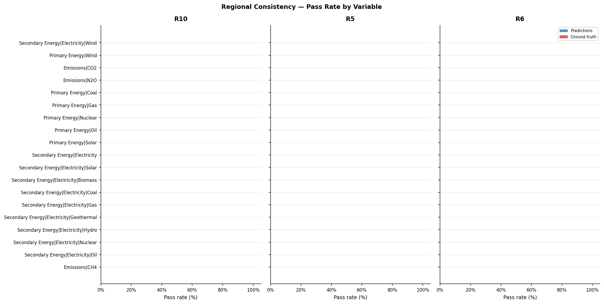

# Validation Report: xgb_04

**Run ID:** `xgb_04`
**Generated:** 2026-05-05 15:51
**Results:** `results/xgb_04/`

---

## Overview

| Check | Metric | Predictions | Ground Truth |
| --- | --- | --- | --- |
| 1. Hierarchy Sum Check | Pass rate (scenario-regions) | 1.3% | 66.4% |
| 2. Growth Rate Plausibility | Pass rate (timesteps) | 87.4% | 83.1% |
| 3. Regional Consistency | Pass rate (scenario × variable) | 0.0% | 0.0% |
| 4. Physical Bounds Check | Pass rate (timesteps) | 96.3% | 98.4% |
| 5. Hard Historical Constraints | Pass rate (scenarios × sub-checks) | 85.0% | 85.0% |
| 6. Soft Future Constraints | Pass rate (scenarios × sub-checks) | 66.6% | 66.6% |
| 7. Inter-variable Correlations | Mean \|Δr²\| vs ground truth | 0.0277 | 0.0000 (reference) |

---

## 1. Hierarchy Sum Check

_Checks that predicted parent variables equal the sum of their direct children
at every timestep. Predictions are **expected to fail** this check — the failure
rate quantifies how much the model violates IAM accounting identities._

### Pass Rates by Parent Variable

| Parent Variable | Scenario-regions | Pass rate (%) | Mean error (%) | Max error (%) |
| --- | --- | --- | --- | --- |
| Secondary Energy\|Electricity | 1984 | 1.2601 | 6.5384 | 219.8757 |

### Error Distribution

### Mean Error by Year

### Error Percentile Comparison — Predictions vs Ground Truth

| Percentile | Predictions (%) | Ground truth (%) |
| --- | --- | --- |
| p50 | 5.0274 | 0.0025 |
| p75 | 7.9962 | 1.7538 |
| p90 | 12.1709 | 3.6437 |
| p95 | 16.4388 | 5.4734 |
| p99 | 27.9085 | 12.8627 |

### Example Failure

_The median failing scenario (by mean error) is shown below._

#### Example failure — predictions

**Scenario:** POLES ENGAGE | EN_INDCi2030_1000f_COV_NDCp | TUR  
**Parent variable:** Secondary Energy|Electricity  
**Mean error:** 5.07%  (median failing scenario)

| Year | Parent value | Sum of children | Residual | Error (%) | Status |
| --- | --- | --- | --- | --- | --- |
| 2025 | 1358.654 | 1319.613 | 39.041 | 2.87 | FAIL |
| 2030 | 1661.869 | 1614.078 | 47.791 | 2.88 | FAIL |
| 2035 | 1907.483 | 1984.364 | 76.88 | 4.03 | FAIL |
| 2040 | 2329.942 | 2350.778 | 20.836 | 0.89 | PASS |
| 2045 | 2785.21 | 2693.845 | 91.365 | 3.28 | FAIL |
| 2050 | 3267.89 | 3140.077 | 127.814 | 3.91 | FAIL |
| 2060 | 3853.846 | 3729.205 | 124.642 | 3.23 | FAIL |
| 2070 | 4165.657 | 3880.078 | 285.58 | 6.86 | FAIL |
| 2080 | 4229.573 | 3807.653 | 421.92 | 9.98 | FAIL |
| 2090 | 4112.924 | 3726.239 | 386.685 | 9.4 | FAIL |
| 2100 | 3893.672 | 3566.062 | 327.611 | 8.41 | FAIL |

#### Example failure — ground truth

**Scenario:** REMIND-MAgPIE 2.1-4.2 | EN_NPi2020_1200f | USA  
**Parent variable:** Secondary Energy|Electricity  
**Mean error:** 2.62%  (median failing scenario)

| Year | Parent value | Sum of children | Residual | Error (%) | Status |
| --- | --- | --- | --- | --- | --- |
| 2015 | 16086.5 | 16086.4 | 0.1 | 0.0 | PASS |
| 2020 | 16519.2 | 16518.6 | 0.6 | 0.0 | PASS |
| 2025 | 17221.9 | 17206.5 | 15.4 | 0.09 | PASS |
| 2030 | 18565.5 | 18457.7 | 107.8 | 0.58 | PASS |
| 2035 | 19699.9 | 19371.3 | 328.6 | 1.67 | FAIL |
| 2040 | 22477.9 | 21929.0 | 548.9 | 2.44 | FAIL |
| 2045 | 25813.9 | 25103.4 | 710.5 | 2.75 | FAIL |
| 2050 | 28971.6 | 28147.9 | 823.7 | 2.84 | FAIL |
| 2055 | 31449.2 | 30534.3 | 914.9 | 2.91 | FAIL |
| 2060 | 33373.1 | 32359.9 | 1013.2 | 3.04 | FAIL |
| 2070 | 37139.5 | 35690.5 | 1449.0 | 3.9 | FAIL |
| 2080 | 39949.9 | 37944.1 | 2005.8 | 5.02 | FAIL |
| 2090 | 42797.4 | 40399.0 | 2398.4 | 5.6 | FAIL |
| 2100 | 47154.5 | 44389.6 | 2764.9 | 5.86 | FAIL |

---

## 2. Growth Rate Plausibility

_For each predicted trajectory, checks that period-on-period growth rates
fall within empirically-derived bounds from the ground truth data._

**Total timesteps evaluated:** 419,995  
**Violations:** 52,953 (12.61%)  

**Ground truth — violation rate:** 16.89%  
_(-4.29pp difference: predictions vs ground truth)_

### Violation Rate by Variable

### Violation Rate by Scenario Category

| Category | Timesteps | Violations | Violation rate (%) |
| --- | --- | --- | --- |
| C2 | 48716 | 6770 | 13.9000 |
| C1 | 29697 | 4122 | 13.8800 |
| C3 | 123215 | 16981 | 13.7800 |
| C6 | 42883 | 5659 | 13.2000 |
| C4 | 60743 | 7832 | 12.8900 |
| C5 | 66880 | 7305 | 10.9200 |
| C7 | 34694 | 3524 | 10.1600 |
| C8 | 3097 | 280 | 9.0400 |
| no-climate-assessment | 10070 | 480 | 4.7700 |

### Example Violation

_The most extreme growth rate violation is shown below._

#### Example violation — predictions

**Most extreme growth rate violation**

| Variable | Scenario | Region | Category | Year (from) | Year (to) | Growth rate |
| --- | --- | --- | --- | --- | --- | --- |
| Emissions\|CO2 | EN_INDCi2030_900f_NDCp | World | C3 | 2070 | 2080 | -2677.9061 |

#### Example violation — ground truth

**Most extreme growth rate violation**

| Variable | Scenario | Region | Category | Year (from) | Year (to) | Growth rate |
| --- | --- | --- | --- | --- | --- | --- |
| Secondary Energy\|Electricity\|Solar | EN_NPi2020_1000_COV | R10INDIA+ | C3 | 2020 | 2030 | +1719.5934 |

---

## 3. Regional Consistency

_Checks that predicted World values equal the sum of predicted subregion values
(R5 / R6 / R10 groupings). Only applicable to datasets with regional breakdowns._

### Pass Rates by Regional Grouping — Predictions

| Grouping | Total | Passed | Pass rate (%) | Mean error (%) | Max error (%) |
| --- | --- | --- | --- | --- | --- |
| R10 | 8911 | 0 | 0.0000 | 102.4671 | 72430.5507 |
| R5 | 9861 | 0 | 0.0000 | 97.3127 | 26572.6901 |
| R6 | 4427 | 0 | 0.0000 | 100.6412 | 74162.6795 |

### Pass Rates by Regional Grouping — Ground Truth

| Grouping | Total | Passed | Pass rate (%) | Mean error (%) | Max error (%) |
| --- | --- | --- | --- | --- | --- |
| R10 | 8911 | 0 | 0.0000 | 103.8467 | 31624.4313 |
| R5 | 9861 | 0 | 0.0000 | 124.1467 | 242375.6550 |
| R6 | 4427 | 0 | 0.0000 | 105.5932 | 120036.1996 |

### Pass Rate by Variable

---

## 4. Physical Bounds Check

_Checks predictions against hard physical lower bounds (energy variables ≥ 0)
and empirical per-variable bounds derived from ground truth._

**Timesteps checked:** 457,691  
**Violations:** 17,041 (3.723%)  
**Fully clean scenario-regions:** 32,149 / 37,696

### Violations by Variable

### Predictions vs Ground Truth

| Source | Timesteps | Violations | Violation rate |
| --- | --- | --- | --- |
| Predictions | 457,691 | 17,041 | 3.723% |
| Ground truth | 457,691 | 7,257 | 1.586% |

_Predictions show +2.138 pp more violations than ground truth._

### Violation Rate by Variable — Predictions vs Ground Truth

### Example Violation

_The most extreme bounds violation is shown below._

#### Example violation — predictions

**Most extreme bounds violation**

| Variable | Scenario | Region | Category | Year | Value | Units | Violation type |
| --- | --- | --- | --- | --- | --- | --- | --- |
| Secondary Energy\|Electricity | CEMICS-2.0-CDR8 | World | C1 | 2100 | 831072.3969 | EJ/yr | Above empirical upper bound (373710.01) |

#### Example violation — ground truth

**Most extreme bounds violation**

| Variable | Scenario | Region | Category | Year | Value | Units | Violation type |
| --- | --- | --- | --- | --- | --- | --- | --- |
| Secondary Energy\|Electricity | EN_NPi2020_600f | World | C2 | 2100 | 829450.1 | EJ/yr | Above empirical upper bound (373710.01) |

---

## 5. Hard Historical Constraints

_Checks World-level predictions at 2020 against AR6 vetting reference values
(Nicholls et al. 2022, Table 11). PASS = within IP range, WARN = within outer
tolerance, FAIL = outside outer tolerance. Belongs to the **historical and
domain knowledge comparison** validation family._

| Sub-check | N | Pass (%) | Warn (%) | Fail (%) | GT Pass (%) | GT Fail (%) |
| --- | --- | --- | --- | --- | --- | --- |
| ch4_2020 | 89 | 88.8000 | 0.0000 | 11.2000 | 88.8000 | 11.2000 |
| co2_change_2010_2020 | 18 | 100.0000 | 0.0000 | 0.0000 | 100.0000 | 0.0000 |
| co2_eip_2020 | 89 | 53.9000 | 40.4000 | 5.6000 | 88.0000 | 12.0000 |
| nuclear_energy_2020 | 89 | 69.7000 | 20.2000 | 10.1000 | 87.3000 | 12.7000 |
| solar_wind_2020 | 89 | 55.1000 | 9.0000 | 36.0000 | 58.7000 | 41.3000 |

_Skipped sub-checks (required variables absent): ccs_2020: ['Carbon Sequestration|CCS'], primary_energy_2020: ['Primary Energy']_

---

## 6. Soft Future Constraints

_Checks World-level predictions at 2030–2040 against domain-knowledge
plausibility bounds from the AR6 vetting process (Table 11). Belongs to the
**historical and domain knowledge comparison** validation family._

| Sub-check | N | Pass (%) | Fail (%) | GT Pass (%) | GT Fail (%) |
| --- | --- | --- | --- | --- | --- |
| ch4_2040 | 120 | 99.2000 | 0.8000 | 99.2000 | 0.8000 |
| co2_not_negative_2030 | 118 | 100.0000 | 0.0000 | 100.0000 | 0.0000 |
| nuclear_electricity_2030 | 118 | 0.0000 | 100.0000 | 0.0000 | 100.0000 |

_Skipped sub-checks (required variables absent): ccs_2030: ['Carbon Sequestration|CCS']_

⚠️ POSSIBLE UNIT MISMATCH: median 1.255e+04 is ~1046x higher than expected 12 EJ/yr. Check units for Secondary Energy|Electricity|Nuclear

---

## 7. Inter-variable Correlations

_Pearson r² between all variable pairs at years 2030, 2050, and 2100 — comparing
predictions against AR6 ground truth. A well-calibrated emulator should preserve
the correlations present in real IAM data. Methodology follows Li et al. (2025) Fig. 4._

Inter-variable Pearson r² matrices at years 2030, 2050, and 2100, comparing model predictions against AR6 ground truth. Values close to the ground truth indicate the emulator preserves real-world variable relationships. Methodology follows Li et al. (2025) Fig. 4.

### 2030

_Left: predictions. Centre: AR6 ground truth. Right: difference (blue = predictions underestimate correlation, red = overestimate)._

### 2050

_Left: predictions. Centre: AR6 ground truth. Right: difference (blue = predictions underestimate correlation, red = overestimate)._

### 2100

_Left: predictions. Centre: AR6 ground truth. Right: difference (blue = predictions underestimate correlation, red = overestimate)._

### Summary: Mean Absolute Difference in r²

_Average absolute difference between predictions and ground truth correlation matrices (off-diagonal pairs only). Lower is better._

| Year | N variables | Mean \|Δr²\| (off-diagonal) |
| --- | --- | --- |
| 2030.0 | 19.0 | 0.0219 |
| 2050.0 | 19.0 | 0.0261 |
| 2100.0 | 19.0 | 0.035 |

