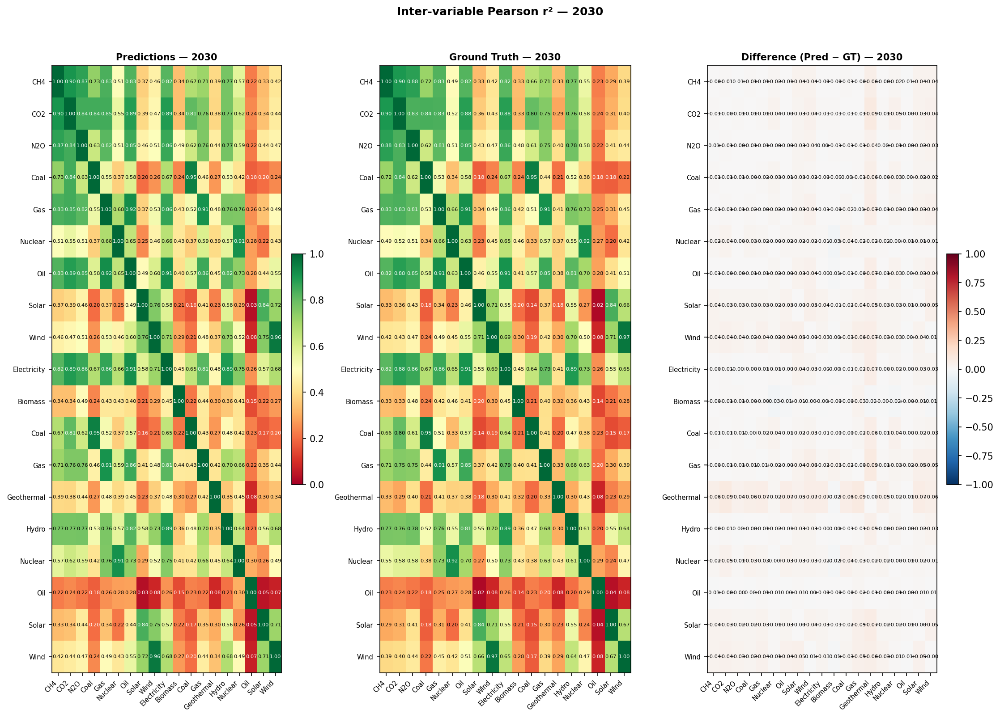
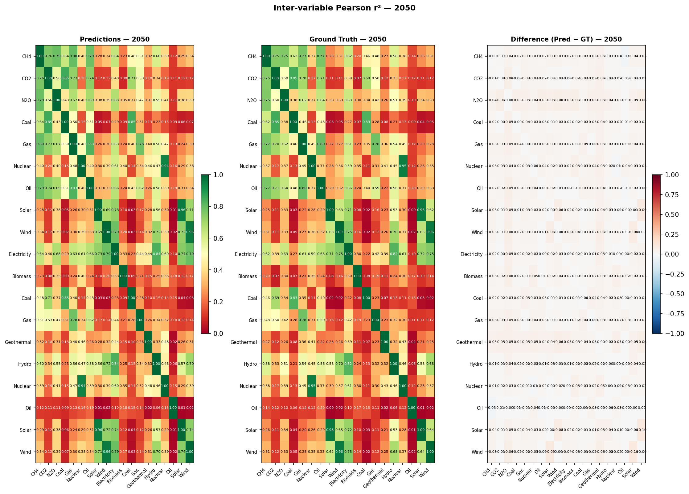
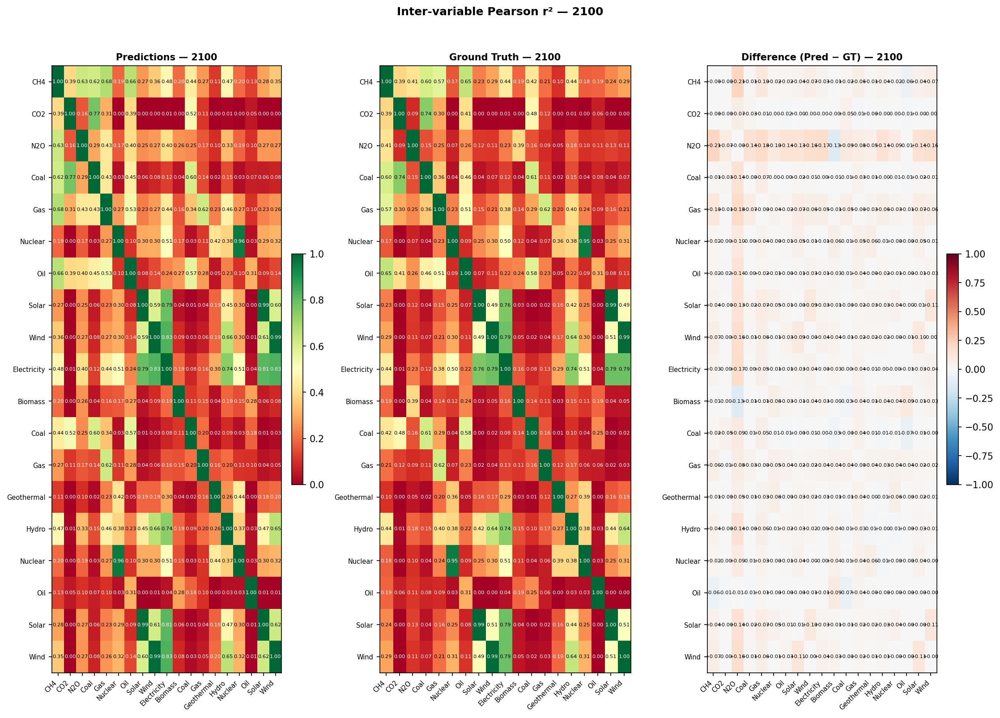

# Validation Report: xgb_04

**Run ID:** `xgb_04`
**Generated:** 2026-05-05 14:46
**Results:** `results/xgb_04/`

---

## Overview

| Check | Key metric | GT available |
| --- | --- | --- |
| Growth rate plausibility | mean pass rate 96.9% | ✓ |
| Hierarchy sum check | mean pass rate 20.4% | ✓ |
| Regional consistency | pass rate 0.2% | ✓ |
| Physical bounds | pass rate 96.3% | ✓ |
| Hard historical constraints | pass rate 68.4% | ✓ |
| Soft future constraints | pass rate 66.6% | ✓ |
| Inter-variable correlation | mean \|Δr²\| 0.0277 | ✗ |

---

## 1. Growth Rate Plausibility

_Period-on-period growth rates checked against empirically-derived bounds from
the ground truth. Violations indicate trajectories with implausible dynamics._

Period-on-period growth rates checked against empirically-derived bounds from the ground truth data. Violations indicate trajectories with implausible dynamics.

| Scenario_Category | Pass_Count | Fail_Count | Pass (%) | GT Pass (%) |
| --- | --- | --- | --- | --- |
| C5 | 64763 | 2117 | 96.8000 | 98.3000 |
| C7 | 33677 | 1017 | 97.1000 | 98.7000 |
| C6 | 41270 | 1613 | 96.2000 | 97.5000 |
| C4 | 58481 | 2262 | 96.3000 | 97.6000 |
| C3 | 118876 | 4339 | 96.5000 | 98.0000 |
| C1 | 28662 | 1035 | 96.5000 | 98.0000 |
| C2 | 46941 | 1775 | 96.4000 | 98.2000 |
| no-climate-assessment | 10025 | 45 | 99.6000 | 99.3000 |
| C8 | 3009 | 88 | 97.2000 | 98.7000 |

---

## 2. Hierarchy Sum Check

_Checks that predicted parent variables equal the sum of their direct children.
The model is expected to fail — the failure rate quantifies how much the
emulator violates IAM accounting identities._

Checks that each parent variable equals the sum of its direct children. The model is expected to fail — the failure rate quantifies how much the emulator violates IAM accounting identities.

**Predictions:** 5,101 / 24,089 scenario-timesteps pass (21.2%)
**Ground truth:** 17,624 / 24,089 pass (73.2%)

---

## 3. Regional Consistency

_Checks that predicted World values equal the sum of subregion predictions
(R5 / R6 / R10 groupings). Only datasets with regional breakdowns are checked._

Checks that predicted World values equal the sum of subregion predictions.

| Source | Pass | Fail | Pass (%) |
| --- | --- | --- | --- |
| Predictions | 634 | 282,181 | 0.2% |
| Ground truth | 2,199 | 280,616 | 0.8% |

---

## 4. Physical Bounds Check

_Checks predictions against hard physical lower bounds and empirical bounds
derived from ground truth._

Checks predictions against hard physical lower bounds (energy variables ≥ 0) and empirical per-variable bounds derived from ground truth.

**Predictions:** 440,650 / 457,691 scenario-variable-timesteps pass (96.3%)
**Ground truth:** 450,434 / 457,691 pass (98.4%)

---

## 5. Hard Historical Constraints

Checks World-level predictions at 2020 against the historical anchor values used in the AR6 scenario vetting process (Nicholls et al. 2022, Table 11). Status: PASS = within IP range, WARN = within outer tolerance, FAIL = outside outer tolerance. Belongs to the **historical and domain knowledge comparison** validation family.

| Sub-check | N | Pass (%) | Warn (%) | Fail (%) | GT Pass (%) | GT Fail (%) |
| --- | --- | --- | --- | --- | --- | --- |
| ch4_2020 | 89 | 88.8000 | 0.0000 | 11.2000 | 88.8000 | 11.2000 |
| co2_change_2010_2020 | 18 | 100.0000 | 0.0000 | 0.0000 | 100.0000 | 0.0000 |
| co2_eip_2020 | 89 | 53.9000 | 40.4000 | 5.6000 | 49.4000 | 6.7000 |
| nuclear_energy_2020 | 89 | 69.7000 | 20.2000 | 10.1000 | 69.7000 | 10.1000 |
| solar_wind_2020 | 89 | 55.1000 | 9.0000 | 36.0000 | 49.4000 | 34.8000 |

_Skipped (required variables absent): ccs_2020: ['Carbon Sequestration|CCS'], primary_energy_2020: ['Primary Energy']_

---

## 6. Soft Future Constraints

Checks World-level predictions at specific future years against domain-knowledge plausibility bounds from the AR6 vetting process (Table 11). Not used as hard exclusion criteria in AR6 but flagged as potentially problematic. Warranted via the constraint-violation argument. Belongs to the **historical and domain knowledge comparison** validation family.

| Sub-check | N | Pass (%) | Fail (%) | GT Pass (%) | GT Fail (%) |
| --- | --- | --- | --- | --- | --- |
| ch4_2040 | 120 | 99.2000 | 0.8000 | 99.2000 | 0.8000 |
| co2_not_negative_2030 | 118 | 100.0000 | 0.0000 | 100.0000 | 0.0000 |
| nuclear_electricity_2030 | 118 | 0.0000 | 100.0000 | 0.0000 | 100.0000 |

_Skipped (required variables absent): ccs_2030: ['Carbon Sequestration|CCS']_

⚠️ POSSIBLE UNIT MISMATCH: median 1.255e+04 is ~1046x higher than expected 12 EJ/yr. Check units for Secondary Energy|Electricity|Nuclear

---

## 7. Inter-variable Correlations

_Pearson r² between all variable pairs at years 2030, 2050, and 2100.
A well-calibrated emulator should preserve the correlation structure of the
parent simulation. Methodology follows Li et al. (2025) Fig. 4._

Pearson r² correlation matrices between all predicted variables at key years, compared against AR6 ground truth. Lower mean |Δr²| indicates better preservation of inter-variable relationships.

| Year | N_variables | Mean_abs_diff_r2 |
| --- | --- | --- |
| 2030.0000 | 19.0000 | 0.0219 |
| 2050.0000 | 19.0000 | 0.0261 |
| 2100.0000 | 19.0000 | 0.0350 |

### 2030

### 2050

### 2100

